# Malaria {background-color="#9B0014"}

<br> <br>

<center>

**Russell E. Lewis** <br> Associate Professor of Infectious Diseases <br> Department of Molecular Medicine <br> University of Padua

|  |  |
|------------------------------------|------------------------------------|
| {width="100"} | {width="100"} |

<br>  russelledward.lewis\@unipd.it <br>  [https://github.com/Russlewisbo](https://github.com/Russlewisbo/ESCMID_2022_talk) <br> Slides and course materials: [www.padovaid.com](https://padovaid.com/)

</center>

## Overview {.center}

<br> <br>

By the end of this lecture, students will be able to:

1.  Describe the **life cycle** of *Plasmodium* and its clinical implications
2.  Distinguish the **six human malaria species** by key features
3.  Apply the **WHO criteria** for severe malaria
4.  Select appropriate **diagnostic tests** and interpret results
5.  Prescribe **evidence-based treatment** by species and severity
6.  Counsel on **prevention** and chemoprophylaxis

## The parasite

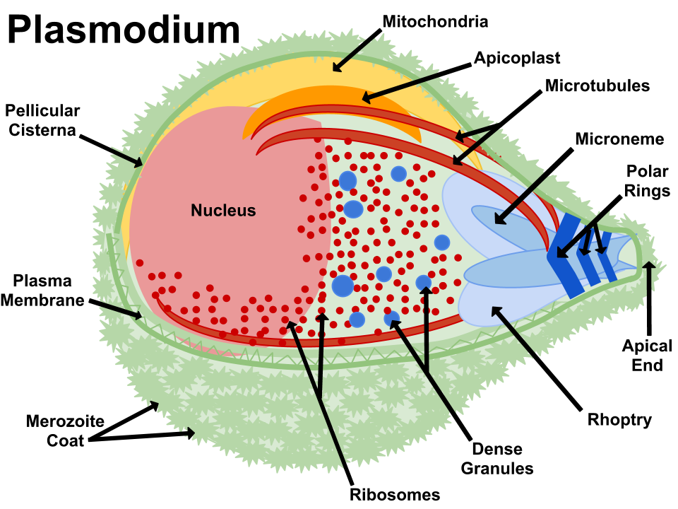{fig-align="center" width="600"}

::: aside
Apicomplexa group of protozoa- specialized complex of apical organelles (micronemes, rhoptries, dense granules) involved in host invasion
:::

## The vector

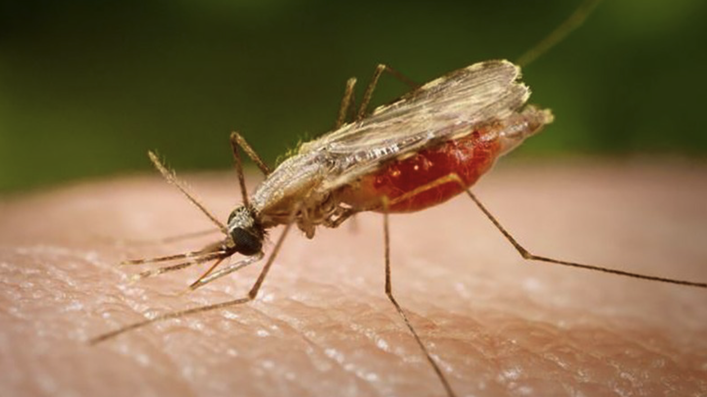{fig-align="center" width="800"}

::: aside
Malaria is transmitted by the bite of Plasmodium-infected female mosquitoes of the Anophelus genus
:::

## Global burden (2023)

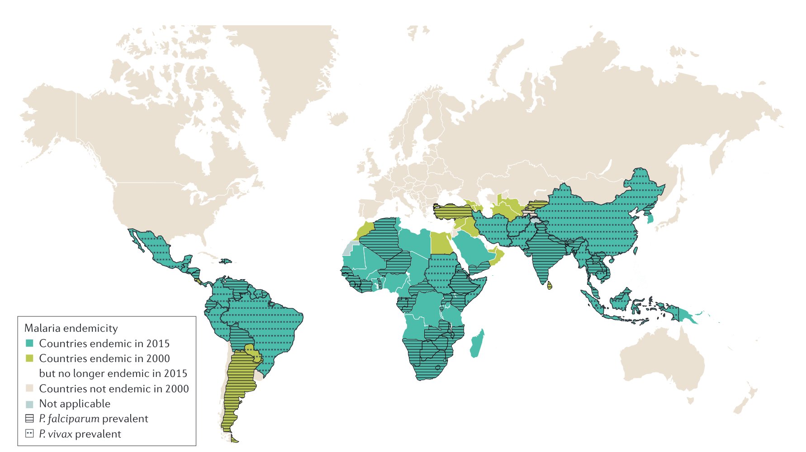{fig-align="center" width="800"}

::: callout-important
## WHO World Malaria Report 2024

-   **263 million** cases
-   **597,000 deaths**
-   **94%** of deaths in Africa
-   Most deaths in **young children**
:::

::: aside
[@phillips2017]
:::

## Taxonomy and nomenclature

<br>

::::: columns
::: column
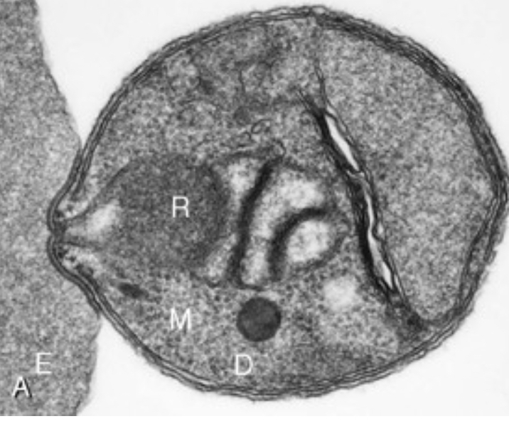{fig-align="center"}
:::

::: column
<br> <br>

-   **Phylum**: Apicomplexa (with *Babesia*, *Toxoplasma*, *Cryptosporidium*)
-   **Genus**: *Plasmodium*
-   **Distinguishing feature**: Apical organelle complex (micronemes, rhoptries, dense granules) mediates host cell invasion
:::
:::::

## Six species that infect humans

<br> <br>

| Species              | Subgenus     | Cycle    | Hypnozoites |
|----------------------|--------------|----------|-------------|
| *P. falciparum*      | Laverania    | 48 h     | **No**      |
| *P. vivax*           | *Plasmodium* | 48 h     | **Yes**     |
| *P. ovale curtisi*   | *Plasmodium* | 48 h     | **Yes**     |
| *P. ovale wallikeri* | *Plasmodium* | 48 h     | **Yes**     |
| *P. malariae*        | *Plasmodium* | 72 h     | No          |
| *P. knowlesi*        | *Plasmodium* | **24 h** | No          |

------------------------------------------------------------------------

## The *Plasmodium* life cycle {.smaller}

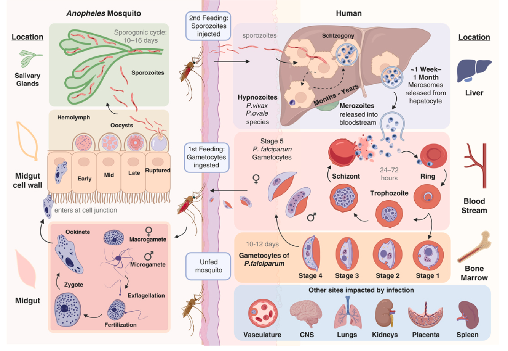{fig-align="center" width="750"}

<br> <br>

::: aside
1.  Infected female Anopheles mosquito injects sporozoites (typically \<100)
2.  Sporozoites travel to liver → invade hepatocytes → schizogony → merozoites released
3.  P. vivax and P. ovale: some sporozoites become dormant hypnozoites (months to years)
4.  Merozoites invade RBCs → ring → trophozoite → schizont → rupture → new merozoites
5.  Asexual cycle: 24h (P. knowlesi), 48h (P. falciparum, vivax, ovale), 72h (P. malariae)
6.  Minority of parasites become gametocytes → taken up by mosquito during blood meal
7.  Sporogonic cycle in mosquito: \~10-16 days depending on temperature The clinical implications: hypnozoites explain relapse, 24h cycle explains rapid progression in P. knowlesi
:::

## Clinical implications of the life cycle

<br>

-   **Incubation period**: 8–25 days (may be longer with partial immunity or prophylaxis)

-   **Hypnozoites** (*P. vivax*, *P. ovale*):

    -   Relapses occur months to **years** after initial infection
    -   Cannot be treated by standard ACTs — require primaquine or tafenoquine

-   **Cyclical fever** reflects synchronous schizont rupture

    -   *Tertian* (48 h): *P. falciparum*, *P. vivax*, *P. ovale*
    -   *Quartan* (72 h): *P. malariae*
    -   Classic periodicity rarely seen at initial presentation

-   **Gametocytes** — the transmission stage:

    -   *P. falciparum*: not infective until mature stage V (10–12 days)
    -   Primaquine destroys mature gametocytes, reducing onward transmission

::: aside
The long incubation means patients may have forgotten their travel exposure. Always ask about travel in the past 3 months. Hypnozoites mean you MUST treat with an 8-aminoquinoline for *P. vivax* and *P. ovale*, otherwise relapses will occur even if the blood-stage infection is cleared.
:::

## Global distribution {.center}

{fig-align="center" width="600"}

<br> <br>

::: aside
Key epidemiological points: - Sub-Saharan Africa has 94% of *P. falciparum* deaths and cases - *P. vivax* predominates in Central/South America and some parts of South/SE Asia - *P. knowlesi* is only in SE Asia (Malaysia, Indonesia, Andaman & Nicobar Islands) - Areas of chloroquine-sensitive *P. falciparum*: Middle East, Central America (west of Panama Canal), Haiti, Dominican Republic - Areas of partial artemisinin resistance: SE Asia (Cambodia, Myanmar, Thailand, Laos, Vietnam), now documented in East Africa. PfPR (top): *P. falciparum* parasite rate. PvPR (bottom): *P. vivax* parasite rate. Data: Malaria Atlas Project, 2025.
:::

## Malaria mortality trends: Two decades of progress and setback {.center}

<br> <br>

**The Great Decline (2000–2015)**

-   Malaria deaths fell from **\~840,000 → \~440,000** (47% reduction)
-   Driven by scale-up of LLINs, ACTs, and IRS
-   LLIN coverage: \<2% → \>60% of at-risk populations
-   ACT replaced failing chloroquine/SP monotherapy <br> <br>

**The plateau and reversal (2015–present)**

-   Progress **stalled** since 2015; slight increase in cases
-   COVID-19 disruption: estimated **+69 million excess cases** and **+386,000 excess deaths** (2020–2021)
-   Pyrethroid resistance in vectors; artemisinin resistance spreading
-   Chronic underfunding (\$4 billion/year needed vs. \$3 billion available)
-   350-500 million per yer cut last year lost from USAID program

## Global Burden (2023)

<br> <br>

| Metric                    | Value                       |
|---------------------------|-----------------------------|
| Cases                     | 263 million                 |
| Deaths                    | 597,000                     |
| \% deaths in Africa       | 94%                         |
| \% deaths in children \<5 | 76%                         |
| Countries with malaria    | 83                          |
| Pregnancies exposed       | \~36% in WHO African Region |

<br> <br>

<center>*"A child in Africa dies of malaria approximately every minute."*</center>

::: aside
The narrative arc here is crucial: enormous progress was made 2000–2015, but we've hit a wall. The tools that got us here (LLINs + ACTs) are losing effectiveness due to resistance, and new tools (vaccines, next-gen nets, gene drives) are only now becoming available. COVID-19 was a major setback — not just from service disruption but from diverting funding and political attention. Malaria control is fragile: without sustained investment, gains reverse quickly.
:::

## Airport malaria and imported cases {.center}

::::: columns
::: {.column width="50%"}
<br> <br>

-   Infected *Anopheles* mosquitoes transported on aircraft

-   Cases occur **within 2 km of international airports** in non-endemic countries

-   \> 100 documented cases in Europe since 1969

-   No travel history → diagnosis often delayed
:::

::: {.column width="50%"}
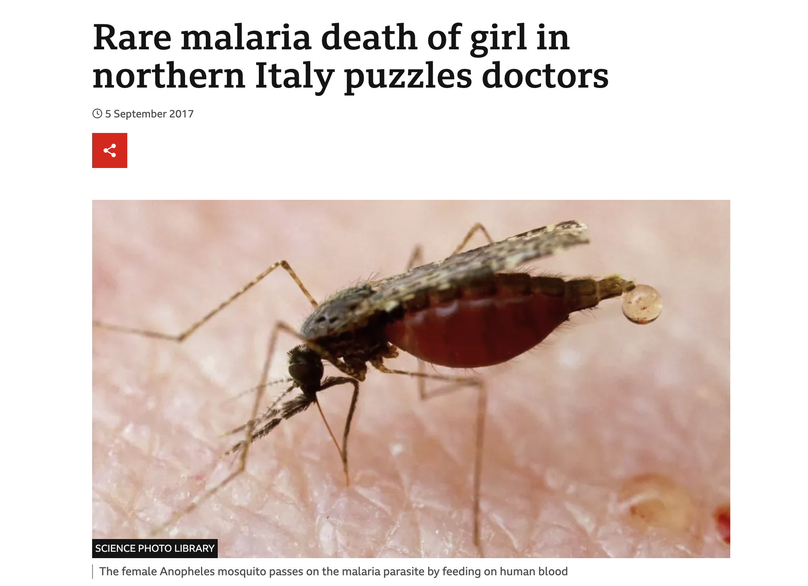{width="424"}
:::
:::::

## Other transmission routes

<br>

-   **Blood transfusion** (rare with screening protocols)
-   **Organ transplantation** from endemic-area donors
-   **Congenital** (vertical transmission)
-   **Nosocomial** (contaminated needles/equipment)

::: aside
The visiting friends and relatives (VFR) traveler group is the most important for European clinical practice. They account for 75% of imported cases but are the hardest to reach with pre-travel counseling. Many feel falsely immune because they grew up in an endemic area, but immunity wanes rapidly after emigrating. Ask specifically about adherence — many start prophylaxis but stop early or take doses irregularly.
:::

## Who gets Malaria? <br>Key risk groups

### In Endemic Areas:

-   **Young children** (under 5): bear the brunt of severe disease
-   **Pregnant women**: placental malaria (CSA-binding variants) → low birth weight, maternal anemia
-   **First-time exposure**: older children, adults in epidemic/low-transmission settings

<br>

### Travelers and Non-immune individuals:

-   All ages equally susceptible to severe disease
-   Typically return from sub-Saharan Africa (88% of US cases) or Asia (8%)
-   \~75% were visiting friends and relatives ("VFR travelers")

### European Context:

-   Semi-immune travelers from endemic countries who visit family often don't seek pre-travel advice, underestimate their risk, and are thus at higher risk

-   They may have partial immunity, but their immunity wanes after years in a non-endemic country

## *Plasmodium falciparum*: Why it's the killer {.center}

<br> <br>

:::: columns
::: {.column width="50%"}
### Unique Pathogenic Features

**Cytoadherence system:**

-   Infected RBCs express **PfEMP-1** (var genes, \~60 variants)

-   PfEMP-1 binds endothelium via CD36, ICAM-1, EPCR, CSA

-   Results in **microvascular obstruction**

**Rosetting:**

-   iRBCs bind uninfected RBCs → clusters obstruct capillaries

-   **High parasitemia:** - Invades all RBC ages → can exceed 10%
:::
::::

<br> <br> <br>

::: aside
The key concept here is that peripheral parasitemia underestimates total body parasite burden because of sequestration. This is why a patient with "only" 5% parasitemia can still be critically ill — there may be much more parasite sequestered in the brain, kidneys, etc. PfHRP2 in plasma better estimates total biomass.
:::

## Parasite morphology

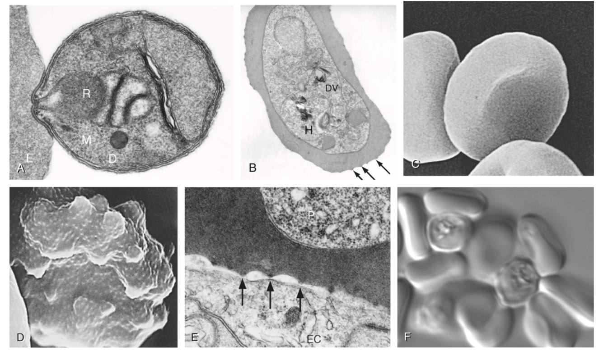{fig-align="center"}

*(A) P. knowlesi merozoite invading RBC. (B) P. falciparum trophozoite with hemozoin. (C-D) Knobs and membrane deformation by P. falciparum. (E) Cytoadherence. (F) Rosetting.*

## Red blood cell rosetting

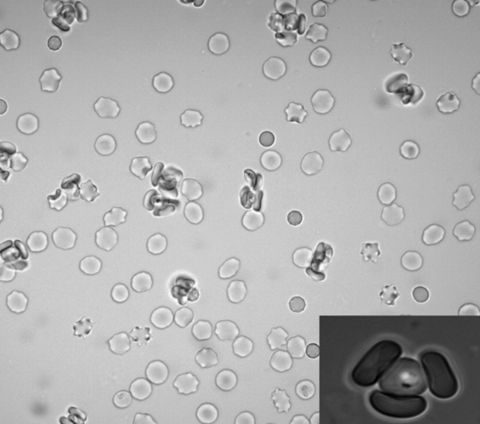{fig-align="center"}

## Resulting pathology

<br> <br>

| Binding molecule | Syndrome                    |
|------------------|-----------------------------|
| EPCR             | Cerebral malaria            |
| CSA              | Placental malaria           |
| CD36             | Microvascular sequestration |
| ICAM-1           | Cerebral/systemic           |

<br> <br>

<center>**Total parasite biomass** (including sequestered parasites) \>\> peripheral blood count</center>

## Cerebral malaria: pathophysiology {.center}

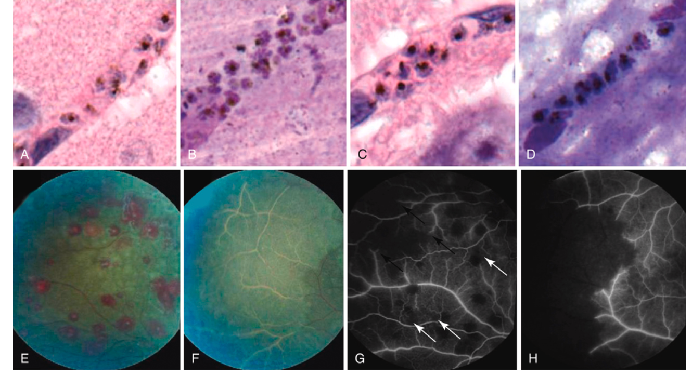{fig-align="center" width="800"}

*Left: Brain histology showing sequestration of parasitized erythrocytes (autopsy). Right: Fluorescein angiography showing retinal whitening (whitened vessels = occluded, nonperfused).*

<br> <br> <br>

::: aside
These are remarkable images from Malawi studies. The histology shows parasitized RBCs packed into cerebral capillaries. The retinal photos demonstrate that malarial retinopathy is a specific marker of cerebral malaria — the absence of retinopathy should redirect attention to non-malarial coma etiologies. Malarial retinopathy features: vessel color changes, white-centered hemorrhages, retinal whitening [@BeareTaylor2009; @MilnerValim2012].
:::

## Naturally acquired immunity ("Premunition")

<br> <br>

**How immunity develops**

-   Mediated by **IgG antibodies** against PfEMP-1 variants, CSP, and merozoite surface proteins
-   Requires **years of repeated exposure** in endemic areas
-   Each infection exposes immune system to a subset of \~60 var gene variants
-   Cumulative repertoire eventually covers the local PfEMP-1 variant spectrum
-   Results in **"disease-controlling immunity"** — not sterilizing

<br> **Key features**

-   Reduces **severity**, not **infection**
-   Parasites still circulate but at low density
-   **Rapidly lost** without ongoing exposure (months to a few years)

## Clinical implications of malaria premunition

<br> <br>

| Population | Immunity | Risk |
|------------------------|------------------------|------------------------|
| Children \<5 y in endemic areas | Minimal | Highest morbidity/mortality |
| Older children/adults in endemic areas | Partial (premunition) | Asymptomatic parasitemia |
| Emigrants from endemic areas (years later) | Waned | At risk again |
| Non-immune travelers | None | Severe disease at any age |
| Pregnant women (primigravida) | Reduced for placental variants | Placental malaria |

<br> <br>

::: aside
Premunition is an important concept: it's not like measles immunity. It's "anti-disease" immunity rather than "anti-infection" immunity. People in endemic areas still harbor parasites — they just don't get sick. This has implications for control: as transmission drops, immunity wanes, and communities become vulnerable again. Emigrants who return to visit family are at particular risk because they've lost their premunition.
:::

## Host genetic factors: Malaria's evolutionary legacy

<br>

Malaria = **strongest known evolutionary selection force** on the human genome

**Protective traits (Heterozygote advantage)**

| Trait | Protection | Mechanism |
|------------------------|------------------------|------------------------|
| **Sickle cell trait** (HbAS) | \~90% vs. severe Pf | HbS polymerization → reduced sequestration; enhanced innate immunity |
| **α-thalassemia** | \~60% vs. severe Pf | Oxidative stress in parasitized RBCs |
| **G6PD deficiency** | \~50% vs. Pf | Increased oxidative damage to parasite |
| **Hemoglobin C** (HbAC) | \~30% vs. severe Pf | Impaired PfEMP-1 display |
| **Hemoglobin E** (HbAE) | Variable | Common in SE Asia |
| **Duffy-negative** (Fy a−b−) | \~100% vs. Pv | Blocks P. vivax RBC invasion receptor |
| **SAO** (ovalocytosis) | Variable | Altered RBC membrane |

## Clinical implications of host genetic factors

<br> <br>

-   These traits reach **carrier frequencies of 5–25%** in endemic regions — balanced polymorphism
-   **Sickle cell disease** (HbSS): homozygous disadvantage but heterozygous carriers (HbAS) strongly protected
-   **G6PD testing** is critical before prescribing primaquine/tafenoquine → hemolytic crisis in deficient patients
-   **Duffy negativity** explains why *P. vivax* is rare in West Africa (\>95% Duffy-negative)
-   These genetic factors explain striking **geographic variation** in malaria susceptibility

<br> <br>

::: callout-note
Malaria has shaped more human genetic diversity than any other infectious disease
:::

## Complications of severe *P. falciparum* malaria {.smaller}

<br> <br>

::::: columns
::: {.column width="50%"}
### Cerebral malaria

-   GCS \<11 (adults) / Blantyre \<3 (children)
-   **Malarial retinopathy**: pathognomonic (white-centered hemorrhages, vessel changes)
-   Recovery often within **24–48 h** of effective therapy (unlike thrombotic stroke)
-   Mortality **15–20%** even with optimal treatment
-   10–15% of survivors: persistent neurological sequelae <br>

### Severe malarial anemia

-   Hemolysis + phagocytic removal + bone marrow suppression
-   **Normocytic normochromic** with blunted reticulocyte response
-   Hb ≤5 g/dL (children) or ≤7 g/dL (adults) + parasitemia \>10,000/μL
-   Transfusion often needed; recovery may take weeks
:::

::: {.column width="50%"}
### Metabolic/renal

-   **Metabolic acidosis**: Best predictor of mortality <br> (lactate ≥5 mmol/L)
    -   Tissue hypoxia from anemia + sequestration + hypovolemia
-   **Hypoglycemia**: Children (↓gluconeogenesis, ↑glucose consumption); Adults (quinine-induced hyperinsulinemia)
    -   Check glucose **q1–2h** for first 24 hours
-   **AKI**: ATN pattern; hemoglobinuria ("blackwater fever"); often requires dialysis

### Pulmonary

-   **Non-cardiogenic pulmonary edema / ARDS**: Sequestration in pulmonary capillaries → endothelial damage
-   Can develop **after** parasite clearance
-   Restrict IV fluids (FEAST trial lesson)

### Other

-   **DIC/bleeding**: Rare (\<5%) but high mortality
-   **Shock**: Bacterial co-infection in 5–8%
:::
:::::

<br> <br> <br>

::: aside
Metabolic acidosis is the single best predictor of death — better than parasitemia.Hypoglycemia is rapidly reversible but commonly missed — always check glucose on admission.Pulmonary edema can worsen paradoxically AFTER treatment starts — be cautious with IV fluids.Bacterial co-infection is common enough that empiric antibiotics should be started in shocked patients.
:::

## Malaria in pregnancy: A special challenge {.center}

<br> <br>

:::::: columns
::: {.column width="55%"}
### Placental malaria

-   *P. falciparum* expresses **VAR2CSA** PfEMP-1 variant
-   VAR2CSA binds **chondroitin sulfate A (CSA)** in placenta
-   Infected RBCs accumulate in **intervillous space** → placental inflammation → impaired nutrient transfer

### Consequences

-   Maternal: severe anemia, hypoglycemia, cerebral malaria
-   Fetal: **low birth weight** (most important), intrauterine growth restriction, preterm delivery, spontaneous abortion
-   Neonatal: increased mortality

### Immunity develops with parity

-   Primigravidae: highest risk (no anti-VAR2CSA antibodies)
-   Multigravidae: progressively protected by antibodies
:::

:::: {.column width="45%"}
### Prevention in endemic areas

::: callout-important
## WHO-recommended bundle

1.  **IPTp-SP** at every ANC visit from 2nd trimester
2.  **LLIN** provided at first ANC visit
3.  Prompt **diagnosis and treatment** of symptomatic malaria
:::

### Treatment considerations

-   **Hospitalize all pregnant women** with confirmed malaria
-   2nd/3rd trimester: ACTs (artemether-lumefantrine preferred)
-   1st trimester: AL now recommended by CDC if alternatives unavailable
-   **Avoid**: doxycycline, primaquine, tafenoquine
-   Delay antirelapse therapy until postpartum
::::
::::::

<br> <br> <br>

::: aside
Pregnancy-associated malaria is a major cause of maternal and neonatal morbidity in sub-Saharan Africa. In 2022, 36% of pregnancies in 33 moderate-high transmission African countries were exposed to malaria. The VAR2CSA explains why first pregnancies are most affected and why protection develops with parity. IPTp-SP is one of the most cost-effective interventions in global health.ANC-Antenatal care visit; IPTp-SP- Intermittent Preventive Treatment in Pregnancy with Sulfadoxine-Pyrimethamine;LLIN- Long lasting insecticidal net, ACT- Artemisinin-based Combination Therapy; AL- Artemether-Lumefantrin
:::

## *Plasmodium vivax* and *ovale*: Special features

<br> <br>

::::: columns
::: {.column width="50%"}
### Hypnozoite Biology

-   Dormant liver forms activate months to **years** after exposure
-   Relapses usually within **3 years**; rare after 5 years
-   Not detectable by blood-stage tests
-   Cannot be treated by ACTs alone → must add primaquine or tafenoquine

### Pathophysiology

-   Selectively invades **reticulocytes** → parasitemia usually **\<1%**
-   Recent evidence: asexual stages cytoadhere to lung endothelium → pulmonary pathology
-   Total parasite biomass \>\> peripheral parasitemia (bone marrow, spleen)
:::

::: {.column width="50%"}
<br> <br> 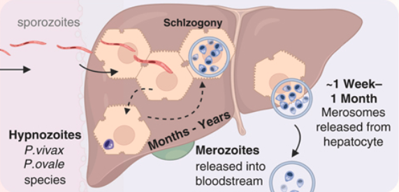
:::
:::::

## *Plasmodium vivax* and *ovale*: Special features

<br> <br>

### Duffy Antigen (DARC)

Critical receptor for *P. vivax* invasion

-   **DARC-negative** (common in West Africa) → relative resistance
-   But *P. vivax* can still infect DARC-negative individuals at lower parasitemias
-   Transferrin receptor 1 recently identified as a reticulocyte-specific receptor

<br>

### *P. ovale*

-   Two sibling species (curtisi, wallikeri)
    -   Cannot be distinguished clinically, only by molecular methods <br>

::: aside
Clinical pearl: A patient who returned from West Africa 2 years ago with fever — *P. vivax* is possible! *P. vivax* can infect DARC-negative individuals, though less commonly. Severe *P. vivax* malaria is real, particularly ARDS and severe anemia.
:::

## *P. malariae* and *P. knowlesi*: Key points {.center}

<br>

::::: columns
::: {.column width="50%"}
### *P. malariae*

**"The long persistent parasite"**

-   Quartan (72-hour) cycle
-   Prefers **older erythrocytes**
-   Parasitemia typically very low <br> (often below microscopy threshold)
-   Can persist **asymptomatically for decades**
-   No hypnozoites — but persistent low-level blood-stage infection
-   Generally mild disease, but can cause nephrotic syndrome (immune complex deposition)
:::

::: {.column width="50%"}
### *P. knowlesi*

**"The zoonotic danger"**

-   **Zoonosis** from long- and pig-tailed macaques
-   Found only in SE Asia (Malaysia, Indonesia, Andaman Islands)
-   **24-hour replication cycle** → rapid parasitemia rise
-   Mimics *P. malariae* morphologically (molecular testing required)
-   Hyperparasitemia: \>2% (\>100,000/μL) = severe
-   Severe disease: jaundice, AKI — more common than in *P. vivax*
:::
:::::

<br> <br> <br>

::: aside
*P. malariae* causing decades-long infection is clinically important: A patient who emigrated from a malaria-endemic region 20 years ago can still have P. malariae. P. knowlesi is a diagnostic trap — it looks like *P. malariae* on microscopy but has a 24-hour cycle. If you see P. malariae morphology in a patient from SE Asia, you must confirm with PCR. The 24-hour cycle means the patient can look fine in the morning and be in multi-organ failure by evening.
:::

## The spectrum of malaria infection {.center}

<br>

```{=html}
<div style="display: flex; align-items: flex-start; gap: 0; font-family: sans-serif; font-size: 0.85em; margin: 1.5em 0;">

  <!-- Stage 1 -->
  <div style="flex: 1; text-align: center;">
    <div style="background: #e8f5e9; border: 2px solid #66bb6a; border-radius: 8px; padding: 0.6em 0.4em; font-weight: bold; color: #2e7d32;">
      Asymptomatic<br>Parasitemia
    </div>
    <div style="color: #555; margin-top: 0.5em; font-size: 0.9em;">
      High endemic,<br>repeated<br>exposure
    </div>
  </div>

  <!-- Arrow -->
  <div style="display: flex; align-items: center; padding: 0 0.3em; margin-top: 0.4em; color: #888; font-size: 1.4em;">→</div>

  <!-- Stage 2 -->
  <div style="flex: 1; text-align: center;">
    <div style="background: #fff8e1; border: 2px solid #ffca28; border-radius: 8px; padding: 0.6em 0.4em; font-weight: bold; color: #f57f17;">
      Uncomplicated<br>Malaria
    </div>
    <div style="color: #555; margin-top: 0.5em; font-size: 0.9em;">
      Fever, headache,<br>malaise, chills<br><em>"flu-like"</em>
    </div>
  </div>

  <!-- Arrow -->
  <div style="display: flex; align-items: center; padding: 0 0.3em; margin-top: 0.4em; color: #888; font-size: 1.4em;">→</div>

  <!-- Stage 3 -->
  <div style="flex: 1; text-align: center;">
    <div style="background: #fce4ec; border: 2px solid #ef5350; border-radius: 8px; padding: 0.6em 0.4em; font-weight: bold; color: #c62828;">
      Severe Malaria<br><span style="font-weight: normal; font-size: 0.9em;">(multi-organ)</span>
    </div>
    <div style="color: #555; margin-top: 0.5em; font-size: 0.9em;">
      Cerebral malaria,<br>severe anemia,<br>ARDS, AKI
    </div>
  </div>

  <!-- Arrow -->
  <div style="display: flex; align-items: center; padding: 0 0.3em; margin-top: 0.4em; color: #888; font-size: 1.4em;">→</div>

  <!-- Stage 4 -->
  <div style="flex: 1; text-align: center;">
    <div style="background: #f3e5f5; border: 2px solid #ab47bc; border-radius: 8px; padding: 0.6em 0.4em; font-weight: bold; color: #6a1b9a;">
      Death
    </div>
    <div style="color: #555; margin-top: 0.5em; font-size: 0.9em;">
      Untreated /<br>delayed<br>treatment
    </div>
  </div>

</div>
```

::: callout-important
## Key Clinical Rule

All non-immune travelers from a malaria-endemic area within the past 3 months who present with fever should be considered to have malaria until proven otherwise — **regardless of prophylaxis taken.**
:::

-   Time to severe malaria: can be hours for *P. falciparum*
-   All non-immune patients with confirmed malaria should be hospitalized

<br> <br> <br>

::: aside
*P. falciparum* uncomplicated malaria can become cerebral malaria within hours. This is why we hospitalize all non-immune patients — you simply cannot safely observe them outpatient. The 3-month rule is critical but not absolute — *P. vivax* relapses can occur years later.
:::

## Uncomplicated malaria: Clinical features

<br>

### Symptoms

-   **Fever** (often \>39–40°C), chills, rigors, sweating
-   Headache, myalgia, arthralgia, malaise, fatigue
-   Nausea, vomiting, abdominal pain
-   Mild splenomegaly with repeated infections

### The classic paroxysm (rare at presentation)

1.  **Cold stage**: chills/rigors (30 min–2 h)
2.  **Hot stage**: high fever, headache, vomiting (2–6 h)
3.  **Sweating stage**: profuse sweating, fatigue (2–4 h)

### What Is Typically ABSENT

-   Cough, rhinorrhea, upper respiratory symptoms
-   Pulmonary consolidation
-   Rash
-   Lymphadenopathy

<br> <br> <br> <br>

::: aside
The classic paroxysm occurs only when infection is synchronous, which takes several days to develop. Most patients at presentation have continuous or irregular fever. The absence of respiratory symptoms is a helpful distinguishing feature from viral URTI, but many patients will initially be diagnosed as viral illness.
:::

## WHO Severe Malaria Criteria (Part 1) {.center}

<br> <br>

**One or more of the following, with parasitemia, excluding alternative causes:**

| Manifestation | Threshold |
|------------------------------------|------------------------------------|
| **Impaired consciousness** | GCS \<11 adults; Blantyre \<3 children |
| **Prostration** | Unable to sit/stand/walk without assistance |
| \*Multiple convulsions\*\* | \>2 fits in 24 hours |
| **Metabolic acidosis** | Base deficit \>8 mEq/L, or bicarb \<15, or lactate ≥5 mmol/L |
| **Hypoglycemia** | Glucose \<2.2 mmol/L (\<40 mg/dL) |
| **Severe malarial anemia** | Hgb ≤5 g/dL (children) / \<7 g/dL (adults) + parasitemia |

::: callout-important
**Adapted from WHO Guidelines for Malaria, October 2023**
:::

------------------------------------------------------------------------

## WHO Severe Malaria Criteria (Part 2) {.center}

<br> <br>

| Manifestation | Threshold |
|------------------------------------|------------------------------------|
| **Renal impairment** | Creatinine \>265 μmol/L (3 mg/dL) or urea \>20 mmol/L |
| **Jaundice** | Bilirubin \>50 μmol/L with high parasite count |
| **Pulmonary edema** | Radiographic confirmation, or SpO₂ \<92% with RR \>30 |
| **Significant bleeding** | Hematemesis, melena, prolonged bleeding |
| **Shock** | *Decompensated*: SBP \<80 mmHg adults, \<70 mmHg children |
| **Hyperparasitemia** | *P. falciparum* \>10%; *P. knowlesi* \>100,000/μL |

::: callout-warning
**In severe malaria: START TREATMENT FIRST. Diagnostic confirmation is important but should not delay therapy.**
:::

<br> <br> <br>

::: aside
WHO criteria are highly sensitive but not very specific , many patients will meet criteria based on fever + any of these signs. The criteria are valuable for guiding treatment intensity and monitoring. Non-immune individuals may have severe malaria even at very low parasitemias. Malarial retinopathy improves specificity for cerebral malaria diagnosis specifically.
:::

## Parasite Morphology: Species Differentiation {.center}

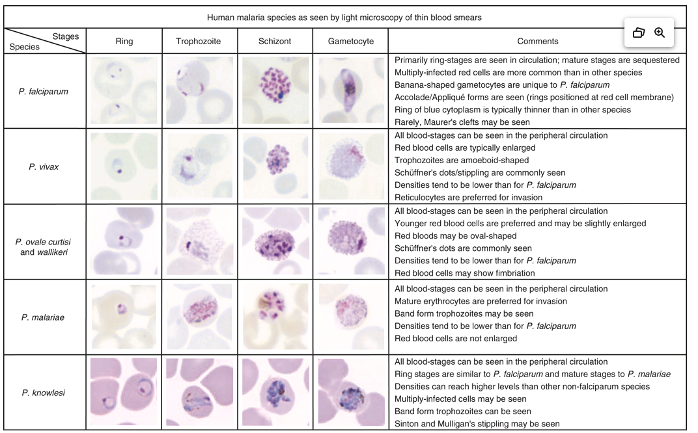{fig-align="center"}

## Key microscopy features for speciation {.center}

| Feature | *P. falciparum* | *P. vivax* | *P. ovale* | *P. malariae* | *P. knowlesi* |
|------------|------------|------------|------------|------------|------------|
| RBC size | Normal | Enlarged | Enlarged | Normal | Normal |
| Schüffner's dots | ❌ | ✅ | ✅ | ❌ | ❌ |
| Max parasitemia | \>10%\* | \<2% | \<1% | \<1% | Variable |
| Gametocyte shape | Banana | Round | Round | Round | Round |
| Distinctive feature | Multiple rings, no mature stages in periphery | Ameboid trophozoites | Fimbriated RBCs | Band trophozoites | Resembles *P. malariae* |
| Cycle | 48 h | 48 h | 48 h | \*2 h | 24 h |

<br> <br>

::: callout-warning
*P. knowlesi* resembles *P. malariae* on light microscopy — **molecular testing (PCR) is required** for definitive speciation of *P. malariae*-like morphology in travelers from SE Asia.
:::

<br> <br>

::: aside
The banana-shaped (crescent) gametocytes are pathognomonic for *P. falciparum* — no other human malaria species has this shape. Multiple ring forms per RBC also suggests *P. falciparum*. The absence of mature trophozoites/schizonts in peripheral blood of *P. falciparum* (due to sequestration) is another distinguishing feature.
:::

## Diagnostic tests: Overview {.center}

<br> <br>

:::::: columns
::: {.column width="33%"}
### Microscopy

**Gold Standard**

-   Species ID + quantification ✅
-   Available worldwide ✅
-   Stage identification ✅\
-   Requires expertise ❌
-   Labor-intensive ❌
-   At least 200 fields for negative ❌

*Sensitivity: \~50–500 parasites/μL*
:::

::: {.column width="33%"}
### Rapid Diagnostic Test (RDT)

**Frontline Tool**

-   Rapid result (15 min) ✅
-   Microscopy expertise needed ✅
-   P. falciparum: sensitivity 94.8% ✅
-   No quantification ❌
-   False negatives: HRP2 deletions ❌
-   Cannot monitor treatment❌

*Do NOT use to monitor response*
:::

::: {.column width="33%"}
### PCR

**Reference Standard**

-   Highest sensitivity ✅
-   Species + quantification ✅
-   Drug resistance testing ✅
-   Available only in reference labs ❌
-   Slow turnaround (not for acute Dx) ❌
-   Expensive ❌

*Best for: speciation confirmation, low-density infections, mixed infections*
:::
::::::

<br> <br> <br>

::: aside
In practice: A patient presenting with fever after travel to Africa gets a thin+thick smear AND an RDT simultaneously. PCR is reserved for equivocal cases, speciation confirmation, drug resistance testing. Remind students of the growing HRP2 deletion problem — in parts of Africa and Peru, P. falciparum has deleted the hrp2 gene, making HRP2-based RDTs false-negative. This is a major surveillance challenge.
:::

## Comparison of malaria diagnostics {.smaller .center}

<br>

| Feature | Expert Microscopy | Conventional RDT (HRP2/pLDH) | Ultrasensitive RDT | PCR / LAMP | qRT-PCR |
|------------|------------|------------|------------|------------|------------|
| **Detection limit** | 50–500 parasites/μL (thick); 200–500 (thin) | 100–200 parasites/μL (HRP2); 200–500 (pLDH) | 1–10 parasites/μL | 0.5–5 parasites/μL | 0.02–1 parasite/μL |
| **Turnaround time** | 30–60 min (trained reader) | 15–20 min | 15–20 min | 1–3 hours (PCR); 30–60 min (LAMP) | 2–4 hours |
| **Species ID** | Yes (thin smear) | *Pf* only (HRP2); *Pf* + pan (combo) | *Pf* only or *Pf* + pan | Yes (all species) | Yes (all species) |
| **Quantification** | Yes (parasites/μL) | No (qualitative) | No (qualitative) | Semi-quantitative | Yes (copies/μL) |
| **Equipment** | Microscope, stains, trained reader | None (lateral-flow strip) | None | Thermal cycler (PCR) or heat block (LAMP) | RT-PCR instrument |
| **Drug resistance** | No | No | No | Possible (K13, pfcrt, pfmdr1) | Possible |
| **Post-treatment monitoring** | Yes | **No** — HRP2 persists 28+ days | **No** | Yes | Yes |
| **Key limitation** | Expertise-dependent; false negatives in early *Pf* (sequestration) | HRP2 deletions → false neg; no quantification | Limited availability | Not point-of-care; cost | Not point-of-care; cost |

<br>

### Ancillary laboratory findings in malaria

-   **Thrombocytopenia** (\<150 × 10⁹/L) — present in **60–80%** of cases; strongly suggestive (sensitivity 60%, specificity 88% for malaria vs. other febrile illness)
-   **Elevated LDH and indirect bilirubin** — markers of hemolysis
-   **Normocytic normochromic anemia** — from hemolysis + bone marrow suppression (↓erythropoietin by TNF-α)
-   **Metabolic acidosis** (base deficit \>8, lactate ≥5 mmol/L) — key severity marker
-   **Hypoglycemia** (\<2.2 mmol/L adults; \<3 mmol/L children \<5 y) — check on admission and q1-2h

<br> <br>

::: aside
Thrombocytopenia is so common in malaria that its absence should make you reconsider the diagnosis. The combination of thrombocytopenia + fever + travel to endemic area has a positive predictive value \>80% for malaria. Lactate and base deficit are the best laboratory predictors of mortality in severe malaria — better than parasitemia. Highlight to students that a normal WBC count is typical in malaria; leukocytosis suggests concomitant bacterial infection.
:::

## The HRP2 deletion problem {.center}

::: callout-warning
## A Critical Diagnostic Pitfall

**PfHRP2 deletions** in *P. falciparum* cause **false-negative RDTs** based on HRP-2 detection alone.

-   Reported from: Eritrea, Ethiopia, Djibouti, Peru, Amazon region
-   Prevalence increasing; detected in travelers
-   Panel RDTs (HRP2 + pLDH) or microscopy are recommended in affected regions

**Clinical implication**: A negative RDT does NOT rule out severe P. falciparum malaria. Treat on clinical suspicion if the test is negative but malaria is likely.
:::

## Differential diagnosis of malaria {.center}

**Malaria mimics many diseases — and many diseases mimic malaria**

| Category | Diagnoses to Consider | Distinguishing Clues |
|------------------------|------------------------|------------------------|
| **Viral** | Influenza, dengue, chikungunya, Zika, yellow fever, COVID-19, VHF, viral meningitis | Dengue: more severe myalgia/arthralgia, rash, shorter incubation (4–7 d); Yellow fever: biphasic, relative bradycardia; COVID: anosmia, respiratory Sx |
| **Bacterial** | Enteric fever (typhoid), nontyphoidal bacteremia, leptospirosis, rickettsiosis, bacterial meningitis | Typhoid: rose spots, relative bradycardia, diarrhea/constipation; Lepto: conjunctival suffusion, biphasic illness; Rickettsia: eschar, rash |
| **Parasitic** | Acute schistosomiasis (Katayama), African trypanosomiasis, visceral leishmaniasis | Schisto: freshwater exposure, eosinophilia, urticaria; Tryps: chancre, posterior cervical LN; VL: massive splenomegaly, pancytopenia |

::: callout-important
**Key Principle**: In any febrile returned traveler, consider **co-infections** — malaria + typhoid, malaria + bacteremia, or malaria + dengue are common combinations, especially in sub-Saharan Africa.
:::

<br> <br> <br>

::: aside
Malaria should always be at the top of the differential for fever + travel to endemic area. However, malaria does NOT rule out other diagnoses — bacterial co-infection is present in 5–8% of severe malaria cases, and empiric antibiotics should be started in any patient with shock. Dengue and malaria co-infection is increasingly recognized in SE Asia and South America.
:::

------------------------------------------------------------------------

## Treatment decision framework {.center}

```{=html}
<figure style="font-family: sans-serif; font-size: 0.85em; max-width: 700px; margin: auto;">
<style>
  .flow-box { border: 2px solid #2c7bb6; border-radius: 6px; padding: 8px 14px; background: #eaf4fb; text-align: center; display: inline-block; }
  .flow-box.decision { background: #fff3cd; border-color: #e6a817; }
  .flow-box.action   { background: #d4edda; border-color: #28a745; }
  .flow-box.urgent   { background: #f8d7da; border-color: #dc3545; }
  .flow-box.start    { background: #d0e8ff; border-color: #1a5c99; font-weight: bold; }
  .arrow  { text-align: center; color: #555; font-size: 1.2em; line-height: 1; margin: 2px 0; }
  .flow-col { display: flex; flex-direction: column; align-items: center; gap: 4px; flex: 1; }
  .flabel { font-size: 0.85em; font-weight: bold; color: #555; }
</style>
<div style="display:flex; flex-direction:column; align-items:center; gap:4px;">
  <div class="flow-box start">Malaria confirmed or strongly suspected</div>
  <div class="arrow">&#8595;</div>
  <div class="flow-box decision">Is the patient <strong>SEVERE</strong>?<br><small>(WHO criteria, or unable to take oral medications)</small></div>
  <div class="arrow">&#8595;</div>
  <div style="display:flex; width:90%; justify-content:space-around; align-items:flex-start; margin-top:4px;">
    <div class="flow-col">
      <span class="flabel" style="color:#dc3545;">YES</span>
      <div class="arrow">&#8595;</div>
      <div class="flow-box urgent"><strong>IV artesunate</strong><br><small>(emergency)</small></div>
    </div>
    <div class="flow-col">
      <span class="flabel" style="color:#28a745;">NO</span>
      <div class="arrow">&#8595;</div>
      <div class="flow-box decision">What <strong>species</strong> + <strong>where acquired</strong>?</div>
      <div class="arrow">&#8595;</div>
      <div style="display:flex; width:100%; justify-content:space-around; align-items:flex-start; margin-top:2px;">
        <div class="flow-col">
          <span class="flabel" style="color:#c0392b; font-size:0.82em;"><em>P. falciparum</em><br>(or unknown)</span>
          <div class="arrow">&#8595;</div>
          <div class="flow-box decision">Chloroquine-resistant area?</div>
          <div class="arrow">&#8595;</div>
          <div class="flow-box action"><strong>ACT</strong> (1st line)</div>
          <div style="margin-top:6px;" class="flow-box decision">Chloroquine-sensitive area?</div>
          <div class="arrow">&#8595;</div>
          <div class="flow-box action"><strong>Chloroquine</strong></div>
        </div>
        <div class="flow-col">
          <span class="flabel" style="color:#1a5c99; font-size:0.82em;">Non-falciparum<br><small>(<em>P. vivax, P. ovale,<br>P. malariae, P. knowlesi</em>)</small></span>
          <div class="arrow">&#8595;</div>
          <div class="flow-box action"><strong>Chloroquine</strong> (if sensitive)<br><strong>OR ACT</strong><br><small>+ Primaquine / tafenoquine<br>for <em>P. vivax / P. ovale</em></small></div>
        </div>
      </div>
    </div>
  </div>
</div>
<figcaption style="text-align:center; margin-top:12px; color:#555; font-size:0.82em;">Figure: Simplified malaria treatment algorithm. ACT&#160;= artemisinin-based combination therapy.</figcaption>
</figure>
```

::: notes
Walk through this algorithm. The key decision points are: (1) Severe vs. uncomplicated — this determines IV vs. oral treatment. (2) Species and geography — this determines resistance profile. (3) For non-falciparum with hypnozoites — don't forget the radical cure (antirelapse therapy).
:::

------------------------------------------------------------------------

## First-line treatment: Uncomplicated *P. falciparum* {.center}

<br>

### Artemisinin-based combination therapies (ACTs)

::::: columns
::: {.column width="60%"}
| Regimen                               | Schedule                        |
|---------------------------------------|---------------------------------|
| Artemether-lumefantrine (AL, Coartem) | 3 days × 2 daily (weight-based) |
| Artesunate-amodiaquine                | 3 days × 1 daily                |
| DHA-piperaquine                       | 3 days × 1 daily                |
| Artesunate-mefloquine                 | 3 days × 1 daily                |
| Artesunate-SP                         | 3 days AS + single SP           |
| Artesunate-pyronaridine               | 3 days × 1 daily                |
:::

::: {.column width="40%"}
### Why ACTs?

-   Artemisinins: fastest-acting
-   Rapid parasite clearance
-   Short half-life → partner drug prevents resistance
-   Active against early gametocytes → reduces transmission

### Resistant Areas

-   SE Asia, parts of East Africa: K13 mutations
-   ACT still first-line; add IV quinine for severe disease in these areas
:::
:::::

<br> <br>

::: aside
Coartem is given with food or milk because lumefantrine has very poor bioavailability without fat. The second dose (8 hours after first) is often forgotten. In SE Asia (Cambodia, Myanmar, Thailand, Laos, Vietnam), partial artemisinin resistance (K13 mutations) means parasites survive for longer and treatment may fail.
:::

------------------------------------------------------------------------

## Weight-Based ACT Dosing {.smaller .center}

### Artemether-Lumefantrine (Coartem) — 6-Dose Regimen Over 3 Days

| Body Weight | Artemether/Lumefantrine per dose | Tablets per dose (20/120 mg) | Schedule |
|------------------|------------------|------------------|------------------|
| 5–\<15 kg | 20/120 mg | 1 tab | 0, 8, 24, 36, 48, 60 h |
| 15–\<25 kg | 40/240 mg | 2 tabs | 0, 8, 24, 36, 48, 60 h |
| 25–\<35 kg | 60/360 mg | 3 tabs | 0, 8, 24, 36, 48, 60 h |
| ≥35 kg (adult) | 80/480 mg | 4 tabs | 0, 8, 24, 36, 48, 60 h |

⚠️ **Must be given with fatty food/milk** (lumefantrine requires fat for absorption — bioavailability ↑16-fold)

<br>

### Other key ACT dosing

| Regimen | Adult dose | Key points |
|------------------------|------------------------|------------------------|
| **Artesunate-amodiaquine** | AS 4 mg/kg/day + AQ 10 mg base/kg/day × 3 days | Fixed-dose combo available (ASAQ) |
| **DHA-piperaquine** | DHA 4 mg/kg/day + PPQ 18 mg/kg/day × 3 days | Once daily; no food requirement; QTc prolongation risk |
| **Artesunate-mefloquine** | AS 4 mg/kg/day × 3 days + MQ 8.3 mg base/kg/day × 3 days | MQ given on days 2–3 to reduce vomiting |
| **Artesunate-SP** | AS 4 mg/kg/day × 3 days + single SP (25/1.25 mg/kg) day 1 | Contraindicated in sulfonamide allergy |
| **Artesunate-pyronaridine** | AS 4 mg/kg/day + PYR 6 mg/kg/day × 3 days | Repeat courses: check ALT |

<br>

### Non-ACT alternatives (when ACTs unavailable)

| Regimen | Dosing | Indication |
|------------------------|------------------------|------------------------|
| **Atovaquone-proguanil** (Malarone) | Adult: 4 tabs (1000/400 mg) daily × 3 days | Uncomplicated *Pf*; common in US/Europe |
| **Quinine + doxycycline** | Quinine 650 mg (10 mg/kg) q8h × 3–7 days + doxy 100 mg BID × 7 days | Alternative; not in pregnancy/children \<8 y |
| **Quinine + clindamycin** | Quinine 650 mg q8h × 3–7 days + clinda 20 mg/kg/day ÷ 3 doses × 7 days | Pregnancy-safe alternative to quinine-doxy |
| **Chloroquine** | 600 mg base, then 300 mg at 6, 24, 48 h (total 25 mg base/kg) | *P. vivax/ovale/malariae* & CQ-sensitive *Pf* areas only |

::: notes
Key teaching points: (1) The 6-dose Coartem schedule is critical — the second dose at 8 hours is the most commonly missed dose in clinical practice. (2) For DHA-piperaquine, obtain a baseline ECG if the patient has cardiac risk factors — piperaquine prolongs QTc. (3) The atovaquone-proguanil dose for TREATMENT is 4 tabs daily (not 1 tab as for prophylaxis) — a very common prescribing error. (4) Quinine-clindamycin is the go-to regimen for pregnant women in the first trimester when AL is not available.
:::

------------------------------------------------------------------------

## Antirelapse treatment: The radical cure {.center}

::: callout-important
## Mandatory for *P. vivax* and *P. ovale*

**ALL cases must receive an 8-aminoquinoline class agent to eliminate hypnozoites.** ACTs/chloroquine treat only the blood stage — they do NOT prevent relapse.
:::

::::: columns
::: {.column width="50%"}
### Primaquine

-   0.5 mg base/kg/day × 14 days (standard)
-   OR 1 mg base/kg/day × 7 days (high dose; geographic regions)
-   Can be used in children ≥6 months
-   **Contraindications**: pregnancy, severe G6PD deficiency
:::

::: {.column width="50%"}
### Tafenoquine (Krintafel)

-   **Single 300 mg dose** (CDC) for age ≥16 years
-   More convenient — but longer half-life (\~12 days) → greater hemolysis risk if G6PD-deficient
-   Requires quantitative G6PD testing
-   **Contraindications**: pregnancy, G6PD deficiency, history of psychosis
:::
:::::

::: callout-warning
## G6PD Testing is MANDATORY Before Prescribing Either Drug

Qualitative testing sufficient for primaquine if no severe deficiency; quantitative/semiquantitative required before tafenoquine.
:::

<br> <br> <br> <br> <br>

::: aside
This is one of the most common clinical errors: treating P. vivax with chloroquine or an ACT alone and failing to add primaquine/tafenoquine. The patient clears the blood-stage infection, feels better, stops taking medications, then relapses 6 months later. Another common error is giving primaquine without checking G6PD status — can cause severe hemolytic anemia in G6PD-deficient patients. Qualitative tests are not sensitive enough to detect heterozygous females (who have intermediate G6PD activity). This matters because: heterozygous females can still be at risk of hemolysis with primaquine Tafenoquine (single dose, longer half-life) requires quantitative G6PD testing before use, because of this limitation. The WHO recommends quantitative testing when available
:::

## Treatment of severe malaria {.center}

<br>

::::: columns
::: {.column width="55%"}
### Drug of Choice: IV Artesunate

**Standard dose:** - 2.4 mg/kg IV at 0, 12, 24 h (3 doses) - Then 2.4 mg/kg IV once daily

**Children \<20 kg (WHO recommendation):** - 3 mg/kg per dose

**Post-treatment hemolysis**: Monitor for delayed hemolytic anemia (especially non-immune travelers with hyperparasitemia)
:::

::: {.column width="45%"}
### Areas with partial artemisinin resistance

*(SE Asia, parts of East Africa)*

**Use IV artesunate PLUS IV quinine simultaneously:** - Quinine loading: 20 mg salt/kg over 4 h - Then 10 mg salt/kg q8h

### Follow-on oral therapy

Once parasite density ≤1% and tolerating oral: - Artemether-lumefantrine (preferred) - Or another ACT

### Adjunctive Measures

-   Seizures: benzodiazepines
-   Hypoglycemia: IV glucose
-   Restrict IV fluids (FEAST trial)
-   Empiric antibiotics if shock
-   **NO dexamethasone** (worsens outcomes)
:::
:::::

<br> <br> <br> <br>

::: aside
The artesunate story: IV quinidine was previously the US standard for severe malaria but caused cardiac arrhythmias and was removed from the market. IV artesunate is now commercially available. Multiple RCTs showed increased coma duration and no mortality benefit with dexamethasone.
:::

------------------------------------------------------------------------

## Severe malaria: ICU management pearls

<br>

::::: columns
::: {.column width="50%"}
### Fluid Management

-   **Adults**: restrictive fluid strategy (pulmonary edema risk)
-   **Children**: **FEAST trial** showed fluid boluses **increased** mortality in African children with severe febrile illness → avoid rapid boluses
-   Target euvolemia; use vasopressors early if shock persists
-   Monitor urine output (target ≥0.5 mL/kg/h)

### Respiratory

-   ARDS can develop during or **after** treatment (as parasitemia clears)
-   Low threshold for intubation with lung-protective ventilation
-   Prone positioning if severe ARDS
:::

::: {.column width="50%"}
### Hematologic

-   **Exchange transfusion / RBC exchange**: consider for parasitemia \>10% with severe features
    -   Automated erythrocytapheresis preferred over manual exchange
    -   WHO no longer formally recommends (insufficient evidence), but widely practiced in US/Europe
-   **Post-artesunate delayed hemolysis (PADH)**: hemolytic anemia 1–3 weeks after IV artesunate, especially in non-immune patients with high initial parasitemia
    -   Monitor Hgb weekly for 4 weeks after treatment

### Metabolic

-   Check glucose **every 1–2 hours** (quinine/quinidine stimulate insulin secretion)
-   Correct acidosis with hemodynamic support, not bicarbonate
-   Monitor lactate as prognostic marker
:::
:::::

<br> <br> <br> <br> <br>

::: aside
The FEAST trial was a landmark study that changed fluid management in African children with severe infections — it showed a 3.3% absolute increase in mortality with fluid bolus therapy. This challenged decades of practice and applies to severe malaria. Post-artesunate delayed hemolysis is an important complication to counsel patients about before discharge. It occurs in up to 25% of non-immune travelers treated with IV artesunate and is caused by destruction of once-infected RBCs that had been pitted (cleared of parasite by the spleen but returned to circulation). Patients need follow-up CBC at 7, 14, 21, and 28 days post-treatment.
:::

## Parasitemia monitoring during treatment {.center}

<br>

:::::: columns
::: {.column width="55%"}
### Protocol for Severe Malaria

1.  **Baseline**: Quantify parasitemia at diagnosis
2.  **Every 12 hours**: Repeat thick/thin smear until negative
3.  **Expected clearance**: parasitemia should ↓ by ≥75% at 48 h
4.  **Switch to oral ACT**: when parasitemia \<1% **AND** patient tolerating PO
5.  **Day 7 and Day 28**: follow-up smears to detect recrudescence

### Red flags during treatment

-   Parasitemia **not decreasing** at 24–48 h → consider artemisinin resistance
-   Parasitemia **rising** despite treatment → re-evaluate drug delivery, consider exchange transfusion
-   New severe criteria developing → escalate care
:::

:::: {.column width="45%"}
### Monitoring in uncomplicated malaria

-   Day 0: Baseline parasitemia
-   Day 3: Smear should be negative or near-negative
    -   Persistent day 3 positivity: suspect partial artemisinin resistance
-   Day 7: Confirm cure (particularly in SE Asia)
-   Day 28 (or 42): Definitive assessment
    -   PCR-corrected to distinguish recrudescence from reinfection

::: callout-tip
## Clinical pearl

Parasitemia may transiently **increase** in the first 12–24 hours of treatment with artemisinins — this is due to splenic release of sequestered parasites and does NOT indicate treatment failure.
:::
::::
::::::

<br> <br> <br> <br>

::: aside
The transient increase in parasitemia after starting artemisinins is a common source of anxiety for clinicians unfamiliar with malaria treatment. Artemisinins kill ring-stage parasites and cause de-sequestration of parasitized RBCs from the microvasculature, which temporarily increases the peripheral parasitemia. True treatment failure is defined by persistent parasitemia at 72 hours or recurrence within 28 days. In SE Asia, day 3 positivity rates are used as a sentinel for artemisinin resistance.
:::

## Monitoring treatment response, cont. {.center}

<br>

::::: columns
::: {.column width="50%"}
### Parasitemia monitoring

| Time Point                | Expected Response                         |
|---------------------------|-------------------------------------------|
| **Baseline**              | Quantify parasitemia (parasites/μL)       |
| **12 hours**              | Smear — trend should be downward          |
| **24 hours**              | ≥50% reduction expected with ACTs         |
| **48 hours**              | ≥75% reduction from baseline              |
| **72 hours** <br> (Day 3) | **Should be negative** with effective ACT |
| **Day 7**                 | Confirm clearance                         |
| **Day 28**                | Check for recrudescence vs. reinfection   |

<br>

### Red flags during treatment

-   **Day 3 parasitemia \>3%** (baseline \>100,000/μL) → suspect **artemisinin resistance**
-   **Rising parasitemia** after initial decline → treatment failure
-   **New organ dysfunction** despite falling parasitemia → ARDS (can worsen paradoxically after treatment)
:::

::: {.column width="50%"}
### Additional monitoring in severe malaria

-   **Blood glucose**: q1–2h for first 24 h (hypoglycemia common, recurrent)
-   **Hemoglobin**: daily (delayed hemolysis 7–14 days post-artesunate)
-   **Lactate/base deficit**: best mortality predictor
-   **Renal function**: creatinine, urine output
-   **Fluid balance**: restrict IV fluids (FEAST trial)
-   **Mental status**: serial GCS/Blantyre assessments

<br>

### Post-Artesunate Delayed Hemolysis (PADH)

-   Occurs **7–31 days** after IV artesunate
-   Most common in non-immune travelers with **hyperparasitemia**
-   Mechanism: pitting of once-infected RBCs by spleen → delayed clearance
-   Monitor Hb weekly for 4 weeks after severe malaria treatment
:::
:::::

<br> <br> <br>

::: aside
Post-artesunate delayed hemolysis (PADH) is increasingly recognized and can cause clinically significant anemia requiring transfusion. It happens because artesunate rapidly kills ring-stage parasites but leaves the damaged RBC membrane intact — the spleen then removes these "pitted" RBCs over the following weeks. Risk factors: high initial parasitemia (\>10%), non-immune status, prolonged IV artesunate course. Warn patients before discharge.
:::

## Treatment in pregnancy {.center}

<br>

| Trimester | Preferred Treatment | Notes |
|------------------------|------------------------|------------------------|
| **1st trimester** | Artemether-lumefantrine (if other options unavailable/not tolerated) | 42% lower risk of adverse pregnancy outcomes vs. quinine; CDC recommends if no alternatives |
| **2nd–3rd trimester** | Artemether-lumefantrine | Preferred; well-studied safety profile |
| **All trimesters** | Chloroquine (sensitive areas), quinine + clindamycin | Alternative options |
| **Any trimester — AVOID** | Doxycycline/tetracycline, primaquine, tafenoquine, halofantrine | Teratogenic or hemolytic risk |

::: callout-important
**For hypnozoite clearance in pregnancy**: Delay primaquine/tafenoquine until after delivery and cessation of breastfeeding. Administer weekly chloroquine suppression until delivery.
:::

<br> <br> <br>

::: aside
Pregnancy malaria is particularly dangerous due to placental sequestration of *P. falciparum* (CSA-binding PfEMP-1 variants). This causes low birth weight, maternal anemia, and increased perinatal mortality. All pregnant women with malaria should be hospitalized regardless of apparent clinical severity.
:::

## Treatment failure and recrudescence {.center}

<br> <br>

::::: columns
::: {.column width="50%"}
### Definitions

-   **Recrudescence**: Same parasite strain reappears **\<28 days** after treatment (treatment failure)
-   **Reinfection**: New infection **\>28 days** after treatment (in endemic area)
-   **Relapse**: Hypnozoite activation (*P. vivax/ovale*), weeks to years after primary infection

### Causes of treatment Failure

1.  **Drug resistance** (most important)
2.  **Inadequate dosing** (weight-based errors; obesity)
3.  **Poor adherence** (incomplete course; vomiting)
4.  **Malabsorption** (diarrhea, vomiting)
5.  **Substandard/counterfeit drugs** (common in endemic areas — up to 30% in parts of SE Asia and Africa)
:::

::: {.column width="50%"}
### Management

| Timing | Likely Cause | Action |
|------------------------|------------------------|------------------------|
| **\<14 days** | Recrudescence (resistance or inadequate Rx) | Switch to a **different** ACT |
| **14–28 days** | Probable recrudescence | Switch ACT; consider PCR genotyping |
| **\>28 days** | Likely reinfection (endemic areas) | First-line ACT again |
| **Any time** (*P. vivax/ovale*) | Relapse from hypnozoites | Repeat blood-stage Rx + **add antirelapse therapy** |

### Key points

-   If failure occurs **despite prophylaxis** → use a **different** drug class for treatment
-   PCR genotyping (microsatellites) can distinguish recrudescence from reinfection
-   Always verify: did the patient complete the full course? Did they take Artemether-Lumefantrine with fatty food?
:::
:::::

::: notes
The most common "treatment failure" in clinical practice is actually non-adherence or incorrect dosing — not drug resistance. For Coartem, the 8-hour second dose is frequently missed, and failure to take with fat dramatically reduces lumefantrine levels. Always ask about these factors before concluding drug resistance. Counterfeit drugs are a major problem — in some studies, 30% of antimalarials purchased in SE Asia and Africa contain no active ingredient or sub-therapeutic doses.
:::

------------------------------------------------------------------------

## Reducing transmissibility: Gametocytocidal therapy {.center}

<br>

:::::: columns
::: {.column width="55%"}
### The problem

-   Successful treatment clears **asexual parasites** (rings, trophozoites, schizonts)
-   **Gametocytes** may persist in blood for **weeks** after treatment
-   Gametocytes are not harmful to the patient but are **infectious to mosquitoes**
-   A single treated patient can continue transmission to the community

### The solution: Single low-dose primaquine (SLDPQ)

-   **0.25 mg base/kg** as a single dose (previously 0.75 mg/kg)
-   Given alongside ACT for *P. falciparum* in **low-transmission** settings
-   Reduces gametocyte carriage by **\~two-thirds** at day 8
-   **NOT required** in most of sub-Saharan Africa (high transmission, <br> individual effect minimal)
:::

:::: {.column width="45%"}
### WHO recommendation

::: callout-note
**Add single low-dose primaquine (0.25 mg base/kg)** to ACT treatment for uncomplicated *P. falciparum* in areas approaching elimination, to reduce onward transmission.

At this dose, G6PD testing is **NOT required** (hemolysis risk negligible).
:::

<br>

### Drug-lifecycle matching

| Drug Class                   | Lifecycle Stage Targeted                 |
|------------------------------|------------------------------------------|
| ACTs                         | Asexual blood stages (rings → schizonts) |
| Primaquine/tafenoquine (14d) | Hypnozoites (liver)                      |
| Single low-dose primaquine   | Stage V gametocytes                      |
| Chloroquine                  | Asexual blood stages (CQ-sensitive only) |
::::
::::::

------------------------------------------------------------------------

## Chemoprophylaxis: Drug selection {.smaller .center}

<br> <br>

| Drug | Coverage | Adult Dose | Pediatric Dose | Timing | Key AEs / Contraindications |
|------------|------------|------------|------------|------------|------------|
| **Atovaquone-proguanil** | All areas | 250/100 mg (1 tab) daily | 62.5/25 mg (¼ tab) daily (11–20 kg); 125/50 mg (½ tab) 21–30 kg; 187.5/75 mg (¾ tab) 31–40 kg; adult dose \>40 kg | 1–2 d before → 7 d after | GI upset; take with food; not in pregnancy or \<5 kg |
| **Doxycycline** | All areas | 100 mg daily | 2.2 mg/kg/day (≥8 years only) | 1–2 d before → 4 wk after | Photosensitivity; esophagitis; not in pregnancy or \<8 y |
| **Mefloquine** | All areas except SE Asia | 228 mg base weekly | 5 mg base/kg weekly (≥5 kg); max 228 mg | 1–2 wk before → 4 wk after | Neuropsych AEs; seizure hx; cardiac conduction defects |
| **Tafenoquine (Arakoda)** | All areas; esp. *P. vivax* | 200 mg daily × 3 d load → 200 mg weekly | **Not approved \<18 y** | 3 d before → 7 d after | G6PD testing required; pregnancy; psychosis hx |
| **Chloroquine** | CQ-sensitive only | 300 mg base weekly | 5 mg base/kg weekly | 1–2 wk before → 4 wk after | Retinal toxicity (prolonged use); pruritus; only CQ-sensitive areas |
| **Primaquine** | *P. vivax* areas | 30 mg base daily | 0.5 mg base/kg daily (≥6 mo) | 1–2 d before → 7 d after | G6PD testing required; not in pregnancy |

<br> <br> <br> <br>

::: aside
Decision factors: (1) Where is the traveler going — resistance map is crucial. (2) How long are they going — mefloquine is good for long trips (weekly dosing). (3) Can they tolerate daily medications — atovaquone-proguanil is daily. (4) Are they pregnant or planning to be — chloroquine or mefloquine are safest. (5) Do they have G6PD deficiency? (6) Are they going to SE Asia — mefloquine is contraindicated. **For most sub-Saharan Africa travel, atovaquone-proguanil is the most convenient option.** For children, atovaquone-proguanil or mefloquine are preferred; doxycycline only ≥8 years. Pediatric weight-based dosing — atovaquone-proguanil pediatric tablets (62.5/25 mg) simplify dosing in children.
:::

## Antimalarial Side Effect Profiles {.smaller}

<br> <br>

| Drug | Common Side Effects | Serious / Rare Reactions | Counseling Points |
|------------------|------------------|------------------|------------------|
| **Artemether-lumefantrine** | Headache, dizziness, nausea | QT prolongation (avoid with other QT-prolonging drugs) | Take with fatty food (↑ lumefantrine absorption by 2–3×) |
| **Atovaquone-proguanil** | GI upset, headache | Rare: Stevens-Johnson syndrome | Take with food; avoid in severe renal failure (CrCl \<30) |
| **Doxycycline** | Photosensitivity, GI upset, esophagitis | Rare: pseudotumor cerebri | Take upright with full glass of water; sunscreen essential |
| **Mefloquine** | Vivid dreams, dizziness, insomnia | Neuropsych: anxiety, psychosis, seizures (1:10,000–1:13,000) | Screen for psych history; give test dose 2 wk before travel |
| **Primaquine** | GI upset, methemoglobinemia | **Hemolytic anemia** (G6PD-deficient) | Always check G6PD; take with food |
| **Tafenoquine** | Headache, dizziness | **Hemolytic anemia** (G6PD-deficient); vortex keratopathy | Quantitative G6PD required; long half-life = sustained hemolysis |
| **Chloroquine** | Pruritus (esp. dark skin), GI upset | Retinopathy (long-term use), cardiomyopathy | Annual eye exam if prolonged use (\>5 years) |
| **IV Artesunate** | Post-artesunate delayed hemolysis (PADH) | Transient neutropenia | Monitor CBC weekly × 4 weeks post-treatment |

::: aside
This slide serves as a quick reference for side effects that come up in clinical practice. The most important counseling point for artemether-lumefantrine is taking it with a fatty meal — bioavailability of lumefantrine increases dramatically. For mefloquine, giving a test dose 2 weeks before departure allows the patient to assess tolerability and switch if needed. The mefloquine neuropsychiatric effects are dose-related and more common in women — screen carefully. PADH after IV artesunate is an emerging concern: up to 25% of non-immune travelers develop delayed hemolytic anemia 1-3 weeks after treatment.
:::

## Malaria prevention in endemic populations {.center}

<br> <br>

:::::: columns
:::: {.column width="50%"}
### Intermittent Preventive Treatment in Pregnancy (IPTp)

-   **Sulfadoxine-pyrimethamine (SP)** at each scheduled ANC visit starting 2nd trimester
-   ≥3 doses at ≥1 month intervals recommended by WHO
-   Reduces placental malaria, low birth weight, and neonatal mortality
-   **Must be given as DOT** (directly observed therapy) at ANC clinic
-   Do not give in 1st trimester or within 1 month of delivery
-   Also provide **LLIN** at first ANC visit

::: callout-important
IPTp is one of the most cost-effective maternal health interventions in sub-Saharan Africa.
:::
::::

::: {.column width="50%"}
### Seasonal Malaria Chemoprevention (SMC)

-   **Monthly SP + amodiaquine** for children 3–59 months during rainy/transmission season

-   3–4 monthly cycles per season

-   WHO-recommended in Sahel sub-region of Africa

-   Efficacy: **\>75% reduction** in uncomplicated malaria episodes; **\>50% reduction in mortality**

-   \>45 million children treated in 2022

### Perennial Malaria Chemoprevention (PMC)

-   SP given at routine immunization contacts (10 wk, 14 wk, 9 mo)
-   For areas with year-round transmission
-   Formerly called "IPTi" (intermittent preventive treatment in infants)
:::
::::::

<br> <br>

::: aside
IPTp and SMC are two of the highest-impact malaria interventions in endemic settings. IPTp-SP at ANC visits is cheap, safe, and reduces neonatal mortality by 20–30% in moderate-high transmission settings. The key barrier is ANC attendance — women who don't attend clinic don't get IPTp. For SMC, the main concern is drug resistance — widespread SP+AQ use could select for resistance, though surveillance to date hasn't shown major increases. PMC is the newer WHO term for what was previously IPTi — giving SP at EPI contacts.
:::

## Non-pharmacologic prevention {.center}


## Non-pharmacologic prevention {.center}

::::: columns
::: {.column width="50%"}
### Personal protective measures

-   **DEET-containing repellents** (≥20%) on exposed skin
-   **Permethrin** on clothing/gear
-   Long-sleeved shirts and long pants, especially **dusk to dawn** (peak Anopheles biting time)
-   **LLINs** (Long-Lasting Insecticidal Nets) in sleeping areas
-   Air conditioning and window screens
:::

::: {.column width="50%"}
### Public health/vector control

-   **Indoor Residual Spraying (IRS)** with insecticides
-   Environmental management (draining stagnant water)
-   Larval control
-   Population-level treatment programs- seasonal malaria chemoprevention (children \< 5 years), Mass drug administration (entire population)

### Challenge: Insecticide resistance

-   Pyrethroid resistance increasingly common in African *Anopheles*
-   New insecticide classes and bed net formulations in development
-   *Anopheles stephensi* urban expansion in East Africa
:::
:::::

<br> <br> <br> <br>

::: aside
Anopheles mosquitoes bite predominantly between dusk and dawn — this is different from Aedes species (dengue, Zika) that bite during the day. Bed nets with permethrin are very effective, especially for children in endemic areas. The LLIN rollout was a key contributor to the 60% drop in malaria mortality 2000-2015.
:::

## Pre-travel counseling: A practical approach {.smaller}

<br>

::::: columns
::: {.column width="50%"}
### Risk assessment

1.  **Destination**: country AND specific region (malaria risk varies within countries)
2.  **Itinerary**: urban vs. rural, altitude, season (rainy season = higher risk)
3.  **Duration**: short tourist trip vs. long-term expatriate
4.  **Activities**: safari, trekking, field work (outdoor exposure at night)
5.  **Traveler factors**: pregnancy, age, G6PD status, drug allergies, comorbidities

### Choosing chemoprophylaxis

-   **Most destinations**: atovaquone-proguanil, doxycycline, or mefloquine
-   **Short trips**: atovaquone-proguanil (start 1–2 d before, stop 7 d after)
-   **Budget-conscious/long trips**: doxycycline (cheapest; start 1–2 d before, continue 4 wk after)
-   **Mefloquine**: weekly dosing (start 2 wk before); neuropsychiatric side effects limit use
-   **Tafenoquine** (Arakoda): weekly during travel + 7 d after; requires G6PD testing
:::

::: {.column width="50%"}
### Common counseling pitfalls

-   ❌ "I'll take pills if I get sick" → prophylaxis, not standby treatment
-   ❌ "I grew up there, I'm immune" → immunity wanes after leaving endemic area
-   ❌ "It's a city, no risk" → urban malaria exists (especially *An. stephensi* areas)
-   ❌ Stopping prophylaxis early after return → most require 4-week continuation (except atovaquone-proguanil: 7 days)

### Key Resources for Clinicians

-   **PHE/UKHSA "Guidelines for malaria prevention in travellers from the UK** — published by the UK Health Security Agency; very detailed, destination-specific, updated regularly.
-   **CDC Malaria Map Application**: interactive risk maps
-   **WHO International Travel and Health**: global guidelines
-   Counsel on **personal protective measures** alongside chemoprophylaxis — no drug is 100% effective
:::
:::::

## G6PD Deficiency and Antimalarials {.center}

<br>

:::::: columns
::: {.column width="55%"}
### Why it matters

-   **G6PD deficiency** is the most common enzymopathy globally (\~400 million affected)
-   Highest prevalence in malaria-endemic regions (balanced polymorphism — confers partial protection)
-   **8-aminoquinolines** (primaquine, tafenoquine) cause **oxidative hemolysis** in G6PD-deficient individuals
-   Severity depends on variant: African A− (moderate), Mediterranean B− (severe), SE Asian variants (variable)

### Testing requirements

-   **Primaquine**: G6PD testing required before use; if deficient → 0.75 mg/kg weekly × 8 wk (supervised)
-   **Tafenoquine**: requires **quantitative G6PD assay** (\>70% activity) — qualitative tests insufficient
    -   Long half-life (\~15 days) means hemolysis cannot be stopped by withdrawing drug
:::

:::: {.column width="45%"}
### Practical points

-   **When to test**: before prescribing primaquine/tafenoquine for radical cure OR tafenoquine prophylaxis
-   **Qualitative tests** (fluorescent spot): adequate for primaquine screening
-   **Quantitative tests** (spectrophotometric): required for tafenoquine
-   **Point-of-care** biosensors: increasingly available in endemic settings

::: callout-warning
## Timing Matters

G6PD activity is **falsely elevated** during acute hemolysis or reticulocytosis. Test before treatment or wait until hematologic recovery to get accurate results.
:::
::::
::::::

::: aside
G6PD testing is one of the biggest barriers to radical cure deployment globally. In many endemic settings, G6PD testing is simply not available, which means patients with *P. vivax* don't receive primaquine and continue to relapse. The WHO now recommends G6PD testing before 8-aminoquinoline use, with reduced-dose weekly primaquine (0.75 mg/kg) as an alternative for G6PD-deficient patients — the weekly dose allows RBC recovery between doses. Tafenoquine's long half-life makes it more dangerous in G6PD deficiency because you can't simply stop the drug to halt hemolysis.
:::

-   

## Malaria and Co-Infections {.smaller}

<br>

:::::: columns
::: {.column width="50%"}
### Malaria + HIV

-   **Bidirectional interaction**: HIV increases malaria susceptibility and severity; malaria increases HIV viral load
-   HIV-infected patients have higher parasitemia, more frequent treatment failure
-   **Drug interactions**: avoid artesunate + efavirenz (reduced artesunate levels); AL + lopinavir/ritonavir (QT prolongation risk)
-   Cotrimoxazole prophylaxis in HIV provides partial malaria protection

### Malaria + bacterial sepsis

-   **Non-typhoidal *Salmonella*** bacteremia common with severe malaria (especially children in Africa)
-   Impaired splenic function during acute malaria → bacterial translocation
-   WHO recommends empiric antibiotics for children with severe malaria + signs of sepsis
:::

:::: {.column width="50%"}
### Malaria + pregnancy (Infectious Co-Morbidities)

-   Malaria + HIV in pregnancy: synergistic risk of severe anemia, LBW, maternal mortality
-   IPTp-SP less effective in HIV+ women → cotrimoxazole prophylaxis recommended instead

### Tropical fever overlap syndromes

-   **Dengue + malaria**: co-endemic in SE Asia, South Asia — dual positivity occurs
-   Thrombocytopenia in both → hemorrhagic risk compounded
-   **Typhoid + malaria**: classic co-infection in sub-Saharan Africa; blood cultures essential
-   **Leptospirosis**: similar presentation; consider in travelers with freshwater exposure

::: callout-important
## Clinical pearl

Never assume a single diagnosis in a febrile returned traveler. Blood cultures, dengue serology, and malaria testing should often be sent simultaneously.
:::
::::
::::::

::: aside
Co-infections are a major clinical challenge in tropical medicine. The malaria-HIV interaction is particularly important in sub-Saharan Africa where both diseases are highly prevalent. Drug interactions between antimalarials and antiretrovirals are complex and clinicians should consult updated interaction databases. The association of malaria with non-typhoidal *Salmonella* bacteremia in African children is thought to relate to malaria-induced hemolysis releasing free heme, which impairs neutrophil oxidative burst. In the returned traveler, always think broadly about the differential — dengue and malaria can co-exist.
:::

## Malaria vaccines: A new era {.center}

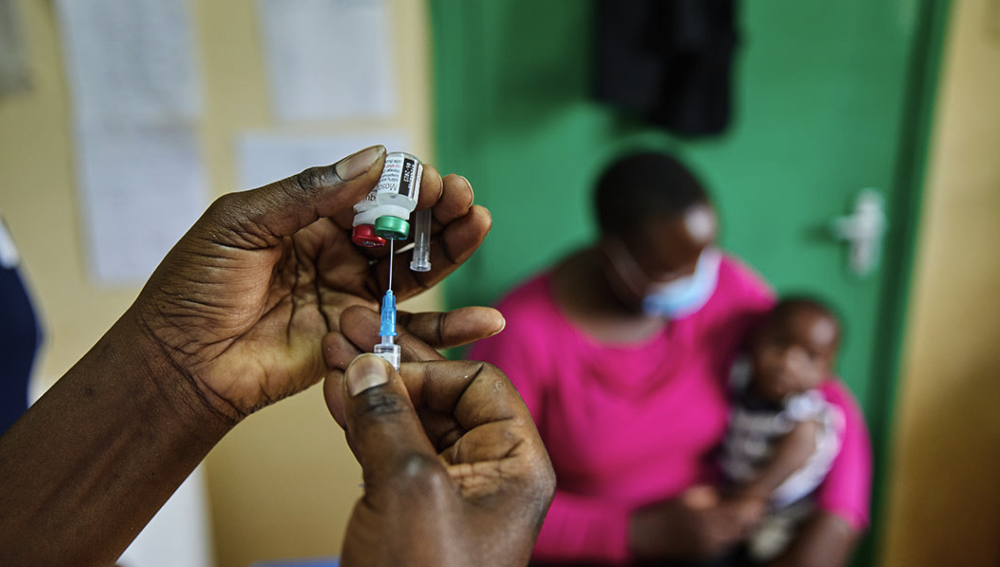{fig-align="center"}

## Malaria vaccines

<br>

::::: columns
::: {.column width="50%"}
### RTS,S/AS01 (Mosquirix)

-   **WHO recommended 2021** for children in endemic areas
-   Based on *P. falciparum* circumsporozoite protein (CSP) fused to hepatitis B surface antigen + AS01 adjuvant
-   **Phase 3 trial** (11 African sites, \>15,000 children):
    -   Efficacy 5–17 mo age group: **39% against clinical malaria** over 4 years (4 doses)
    -   Efficacy against severe malaria: **29%** (with booster)
    -   Protection wanes substantially after year 1 (\~50% → \~25% by year 4)
-   **4-dose schedule**: 3 doses at monthly intervals (age 5–9 mo), booster at 15–18 months
-   Does NOT provide sterilizing immunity — reduces episodes, not infection
-   **\>6 million doses** deployed by end of 2024 across Ghana, Kenya, Malawi, Cameroon, and others [@RTS2015Efficacy]
:::

::: {.column width="50%"}
### R21/Matrix-M

-   **WHO recommended and prequalified October 2023**
-   Also targets CSP, but with **higher CSP:HBsAg ratio** + Matrix-M (saponin) adjuvant
-   Phase 3 results (4,800 children, 4 African countries):
    -   **Seasonal administration**: efficacy **75%** at 12 months (Burkina Faso seasonal trial)
    -   **Year-round settings**: efficacy **68%** at 12 months
    -   Booster at 12 months sustained protection at \~70% through 2 years
-   **4-dose schedule**: 3 monthly doses + booster at 12 months
-   Advantages: **lower cost** (\~\$2–4/dose vs \$9–10 for RTS,S), **easier manufacturing** (higher yield), **thermostable at 40°C** for extended periods
-   Serum Institute of India plans **100+ million doses/year** [@R21Datoo2023]
:::
:::::

## Vaccine pipeline and monoclonal antibodies {.center}

<br>

::::: columns
::: {.column width="50%"}
### Next-Generation Vaccine Approaches

| Approach | Stage | Target | Key Feature |
|------------------|------------------|------------------|------------------|
| **PfSPZ Vaccine** (Sanaria) | Phase 2 | Whole sporozoites | Attenuated radiation; requires IV route and cold chain |
| **PfSPZ-CVac** | Phase 2 | Live sporozoites + CQ | Controlled human malaria infection approach |
| **mRNA-CSP vaccines** | Phase 1 | CSP | Moderna, BioNTech platforms; rapid manufacturing |
| **Blood-stage vaccines** | Phase 1–2 | RH5, PfAMA1 | Reduce parasite density; anti-disease |
| **TBV (Pfs25, Pfs230)** | Phase 1–2 | Gametocyte surface | Transmission-blocking; altruistic vaccine |
:::

::: {.column width="50%"}
### Monoclonal Antibodies (mAbs)

-   **CIS43LS** and **L9LS** (anti-CSP mAbs)
-   Single IV or subcutaneous injection provides **season-long protection** (\~6 months)
-   Phase 2 trial in Malian children and adults: **88% protective efficacy** over 6-month malaria season
-   Potential role: **seasonal chemoprevention alternative**, travelers, pregnant women (no G6PD concern)
-   Limitations: cost, IV/SC route, limited duration

### Challenges Ahead

-   No vaccine for *P. vivax* yet
-   Combining vaccines with existing tools (LLINs, SMC) essential
-   Equitable global access and funding for scale-up
:::
:::::

<br> <br> <br> <br> <br>

::: aside
These are the first vaccines ever approved against a human parasite. While the efficacy is modest compared to childhood vaccines (measles \~97%), even 30-40% efficacy at scale in Africa could prevent hundreds of thousands of deaths. The R21 vaccine is a game-changer largely because of cost and manufacturing: at \$2-4/dose it's affordable for GAVI procurement, and the Serum Institute can produce at enormous scale. The monoclonal antibodies are very exciting for proof of concept — 88% efficacy in a single injection. The question is cost and scalability. mRNA vaccines could change the landscape entirely if they achieve higher efficacy, as manufacturing is rapid and scalable. The transmission-blocking vaccines are conceptually fascinating: they don't protect the individual who gets vaccinated, but instead prevent the mosquito from becoming infected, thereby benefiting the entire community.
:::

## Artemisinin resistance: A growing threat {.center}

<br> <br>

::::: columns
::: {.column width="55%"}
### Background

-   Partial artemisinin resistance = **delayed parasite clearance**
-   Defined as: persistent parasitemia by microscopy at 72 h, OR half-life ≥5 h
-   **K13 mutations** (especially **C580Y**) confer ring-stage survival

### Geographic spread

-   Originally confined to Greater Mekong Subregion (Thailand, Cambodia, Myanmar, Laos, Vietnam)
-   Now documented in **Rwanda, Uganda, Ethiopia, Eritrea**
-   ACT partner drug resistance (piperaquine, mefloquine) compounds the problem in SE Asia
:::

::: {.column width="45%"}
### Clinical implications

-   ACTs remain first-line in most settings
-   In resistant areas: add **IV quinine** to IV artesunate for severe malaria
-   Longer follow-up needed (day 28 vs. day 14)
-   Choose ACT partner drug based on local resistance patterns

### Watch for

-   Fever still present at day 3 of treatment
-   Positive smear at 72 hours
-   Higher treatment failure rates (\>5% after PCR correction)
:::
:::::

<br> <br>

::: aside
The geographic spread of artemisinin resistance to East Africa is alarming. If resistance spreads across sub-Saharan Africa as chloroquine resistance did in the 1980s-1990s, we would lose our most effective antimalarials with no immediate alternatives. This is why surveillance is so critical.
:::

## Chloroquine, quinine and gin and tonic

{fig-align="center" width="500"}

<br> <br> <br>

::: aside
In the 17th century, Europeans learned that the bark of the cinchona tree contained quinine, a compound effective against malaria. By the 18th–19th centuries, quinine was widely used by Europeans living in tropical regions, especially British colonial officers in India. The problem? Quinine tastes extremely bitter.During the era of the British Raj, British soldiers and administrators were required to take quinine regularly as a preventive measure against malaria.To make it tolerable, they mixed it with: water, sugar and lime. This early version of “tonic water” was basically medicinal. Adding gin to the bitter quinine mixture made it far more enjoyable.
:::

## Chloroquine resistance: Decline and recovery {.smaller}

<br> <br>

::::: columns
::: {.column width="50%"}
### The Rise and fall of chloroquine

-   **1957–2000s**: CQ resistance spread globally from SE Asia and South America
-   Mediated by mutations in **pfcrt** (K76T) and **pfmdr1**
-   By 2000: CQ abandoned as first-line therapy across most of Africa
-   Result: **millions of preventable deaths** during transition to alternative drugs (SP, then ACTs)

### The recovery phenomenon

-   After CQ withdrawal → **wild-type pfcrt K76 returns** (fitness cost of resistance)
-   **Malawi** (first to switch, 1993): CQ efficacy recovered to \>95% by 2005
-   Similar trends in parts of Tanzania, Zambia, and other countries
:::

::: {.column width="50%"}
### Clinical implications

-   CQ is **NOT recommended** for *P. falciparum* treatment (WHO)
-   However, the recovery shows drug resistance can be **reversible**
-   Raises possibility of cycling drug regimens in future
-   CQ retains full activity against most *P. vivax* (except Indonesia, Papua New Guinea, parts of SE Asia)

### Lesson for artemisinin resistance

-   Drug pressure drives resistance; removal can restore susceptibility
-   Argues for stewardship: protect ACTs by eliminating monotherapy, ensuring treatment completion
-   **Triple ACTs** (TACT) under investigation to extend ACT lifespan
:::
:::::

::: aside
The chloroquine story is one of the great cautionary tales in infectious diseases. The global spread of CQ resistance caused a massive increase in malaria mortality in Africa in the 1980s-1990s. The recovery of CQ sensitivity suggests that strategic drug rotation could be feasible. The concern is whether artemisinin-resistant parasites will follow the same fitness-cost pattern, or whether compensatory mutations will allow them to maintain resistance without fitness penalty. Triple ACTs (adding a third partner drug) are being tested in clinical trials to try to overwhelm resistance mechanisms.
:::

## Global antimalarial drug policy by region {.smaller}

| WHO Region | First-Line ACT | Key Considerations |
|------------------------|------------------------|------------------------|
| Sub-Saharan Africa | AL or ASAQ | K13 mutations emerging in East Africa (Rwanda, Uganda) |
| Southeast Asia | DHA-PPQ or AL | Highest rates of artemisinin + partner drug resistance |
| South Asia | AL or ASAQ | Generally good ACT efficacy |
| South America | AL or ASAQ | CQ+PQ still used for *P. vivax* |
| Oceania/Pacific | AL | CQ-resistant *P. vivax* in PNG, Indonesia |

::: callout-note
## Abbreviations

AL = artemether-lumefantrine; ASAQ = artesunate-amodiaquine; DHA-PPQ = dihydroartemisinin-piperaquine; ASPY = artesunate-pyronaridine; CQ = chloroquine; PQ = primaquine
:::

::: aside
The choice of ACT varies by region based on resistance patterns. The WHO recommends that countries change first-line ACT when treatment failure rates exceed 10% at day 28 follow-up.
:::

## Vector control: Challenges and innovation {.smaller}

::::: columns
::: {.column width="50%"}
### Current tools

-   **LLINs** (long-lasting insecticidal nets): pyrethroid-based, backbone of prevention
-   **IRS** (indoor residual spraying): effective but operationally demanding
-   **Larval source management**: targeted in urban settings

### The resistance crisis

-   **Pyrethroid resistance**: now widespread in *An. gambiae* across Africa
-   Metabolic resistance (P450 enzyme upregulation) + target-site mutations (*kdr*)
-   IRS rotation to organophosphates, neonicotinoids, clothianidin
:::

::: {.column width="50%"}
### Next-generation approaches

-   **PBO synergist nets**: restore pyrethroid efficacy (Interceptor G2, Royal Guard)
-   **Dual-AI nets**: pyrethroid + chlorfenapyr (Interceptor G2) — 46% reduction vs. standard LLIN
-   **Attractive toxic sugar baits (ATSB)**: target outdoor-biting mosquitoes
-   **Gene drive**: *An. gambiae* population suppression (laboratory stage)
-   ***Wolbachia*****-based strategies**: reduce mosquito competence for *Plasmodium*

### Emerging threat

-   ***Anopheles stephensi***: urban-adapted mosquito spreading across Horn of Africa (Djibouti, Ethiopia, Sudan, Somalia) — threatens to bring malaria into African cities
:::
:::::

::: aside
Vector control has historically been the most impactful intervention against malaria. The insecticide resistance crisis threatens to undo decades of progress. The dual-AI nets (like Interceptor G2 with chlorfenapyr) showed a 46% reduction in malaria prevalence compared to standard pyrethroid nets in a major trial in Tanzania. The spread of *An. stephensi* across the Horn of Africa is particularly concerning — this species breeds efficiently in urban water containers, unlike traditional African vectors, and could bring malaria into densely populated cities that have historically been malaria-free. Gene drive is exciting but faces major regulatory, ethical, and ecological questions.
:::

## Non-Falciparum malaria: Unique challenges 

<br>

::::: columns
::: {.column width="50%"}
### *P. vivax*

-   **Hypnozoites** → relapses weeks to years later
-   Radical cure requires **primaquine** (14 days) or **tafenoquine** (single dose)
-   Both require **G6PD testing** (risk of hemolytic anemia)
-   CQ remains first-line for blood stage (except CQ-resistant areas → ACT)
-   **Tafenoquine** (Krintafel): FDA-approved 2018 — single 300 mg dose
    -   Advantage: adherence; Risk: longer half-life = prolonged hemolysis if G6PD-deficient

### *P. ovale*

-   Also forms hypnozoites → radical cure with primaquine
-   Generally milder disease
-   Two subspecies: *P. o. curtisi* and *P. o. wallikeri*
:::

::: {.column width="50%"}
### *P. malariae*

-   **No hypnozoites** but can cause **chronic parasitemia** (decades)
-   Associated with nephrotic syndrome (immune complex glomerulonephritis)
-   CQ-sensitive; standard CQ treatment adequate
-   Can recrudesce years after initial infection

### *P. knowlesi*

-   Zoonotic (macaque reservoir in SE Asia)
-   **24-hour erythrocytic cycle** → rapid parasitemia rise
-   Can cause severe disease mimicking *P. falciparum*
-   Morphologically confused with *P. malariae* on smear
-   PCR often needed for definitive diagnosis
-   Treat with ACT (or CQ if uncomplicated and confirmed)
:::
:::::

<br> <br> <br> <br> <br>

::: aside
*P. vivax* is the second most important species globally and the dominant species outside Africa (especially South Asia, SE Asia, Central/South America). The hypnozoite stage makes elimination much harder — you must treat not just the blood-stage infection but also the dormant liver forms. The introduction of tafenoquine as a single-dose radical cure is a major advance, but the absolute requirement for G6PD testing (and a quantitative test, not just qualitative) before administration limits its deployment in resource-limited settings. *P. knowlesi* should always be considered in travelers returning from forested areas of SE Asia — it can be rapidly fatal if misidentified as P. malariae.
:::


## Malaria elimination: Where are we? {.center}

<br> <br>

:::::: columns
::: {.column width="50%"}
### Progress toward elimination

-   **40 countries** certified malaria-free by WHO (as of 2024)
-   Recent certifications: China (2021), El Salvador (2021), Azerbaijan (2023), Belize (2023), Cabo Verde (2024)
-   **E-2025 initiative**: 25 countries targeted for elimination by 2025
-   Sri Lanka, Paraguay, Uzbekistan: sustained zero indigenous cases

### Key strategies

-   Surveillance-response systems (detect every case)
-   Mass drug administration (MDA) in specific settings
-   Reactive case detection and treatment
-   Cross-border collaboration
:::

:::: {.column width="50%"}
### Barriers to global eradication

-   *P. vivax* hypnozoites → silent reservoirs
-   Asymptomatic *P. falciparum* carriers sustain transmission
-   Insecticide and drug resistance
-   Health system weaknesses in highest-burden countries
-   Climate change expanding transmission zones
-   Funding gap: \~\$3.5 billion invested vs. \$7.3 billion needed annually (WHO)

::: callout-warning
## Stalled progress

Global malaria cases **increased** from 2019–2023, partly due to COVID-19 disruptions, humanitarian crises, and the funding shortfall. The 2030 targets of 90% reduction are unlikely to be met without accelerated action.
:::
::::
::::::


## Approach to the febrile returned traveler {.center}

::: callout-important
## The 3-Month Rule

**All febrile travelers returning from a malaria-endemic area within the past 3 months have malaria until proven otherwise.** Beyond 3 months, still consider malaria — particularly for *P. vivax* (relapses) and *P. malariae* (chronic infection).
:::

### Immediate Evaluation

1.  **Detailed travel history** — countries, dates, activities, prophylaxis taken and adherence
2.  **Immediate diagnostic testing**: thick + thin blood smears **plus** RDT
3.  **If negative but high suspicion**: repeat smears in 12–24 hours; initiate treatment empirically
4.  **Determine species** — critical for antirelapse treatment and resistance management
5.  **Assess severity** — WHO criteria; **hospitalize all non-immune patients**

### Do not miss

-   Patient was "compliant with prophylaxis" — no prophylaxis is 100% effective
-   Patient visited friends and relatives — often do not seek pre-travel advice, less likely to use chemoprophylaxis
-   Patient returned months ago — *P. vivax*, *P. ovale* relapse, *P. malariae* recrudescence


<br> <br> <br>

::: aside
The VFR (visiting friends and relatives) traveler group accounts for a large proportion of imported malaria cases. They often feel falsely immune, don't take prophylaxis, and delay seeking care. Ask specifically about adherence to chemoprophylaxis — many patients stop early, take doses irregularly, or misunderstand the post-travel continuation period.
:::


## Key summary points {.center}

::::: columns
::: {.column width="50%"}
### Biology

-   Six species; *P. falciparum* most dangerous
-   *P. vivax* and *P. ovale*: hypnozoites → relapses
-   *P. knowlesi*: 24 h cycle, rapid progression
-   *P. falciparum* pathogenesis: cytoadherence + PfEMP-1 → microvascular obstruction

### Diagnosis

-   Thick + thin smear: gold standard
-   RDTs: rapid, but watch for HRP2 deletions
-   PCR: most sensitive, for speciation/reference use
-   Species matters: different treatment implications
:::

::: {.column width="50%"}
### Treatment

-   **Uncomplicated *P. falciparum***: ACT (artemether-lumefantrine in US)
-   **Severe malaria**: IV artesunate (call CDC Hotline if needed)
-   ***P. vivax/ovale***: blood stage + primaquine or tafenoquine (after G6PD testing)
-   **Pregnancy**: artemether-lumefantrine preferred; avoid primaquine/tafenoquine

### Prevention

-   Chemoprophylaxis + LLINs + repellents
-   Vaccines (RTS,S, R21) for endemic-area children
-   **No prophylaxis is 100% effective**
:::
:::::

::: callout-important
## The Golden Rule

**Fever in any traveler returning from a malaria-endemic area = malaria until proven otherwise. Test immediately, treat promptly, hospitalize non-immune patients.**
:::

# Backup slides {background-color="#9B0014"}


## Malaria: History highlights {.center}

:::::: columns
::: {.column width="50%"}
### Key discoveries

| Year    | Discovery                                 |
|---------|-------------------------------------------|
| 17th c. | Peruvian bark (*Cinchona*) used for fever |
| 1820    | Quinine isolated (Pelletier & Caventou)   |
| 1880    | *Plasmodium* identified (Laveran)         |
| 1897    | *Anopheles* as vector (Ross)              |
| 1928    | Pamaquine (first synthetic antimalarial)  |
| 1944    | Chloroquine synthesized                   |
| 1957    | Global eradication campaign launched      |
| 1969    | Eradication campaign abandoned            |
| 1972    | Artemisinins discovered (Tu Youyou)       |
| 2000    | \~2 million deaths/year (peak)            |
| 2015    | Nobel Prize in Medicine — Tu Youyou       |
| 2021    | RTS,S vaccine recommended by WHO          |
| 2023    | R21/Matrix-M vaccine recommended by WHO   |
:::

:::: {.column width="50%"}
### Lessons from history

-   Drug resistance **will emerge** with monotherapy → always use combinations
-   Vector control successes can be reversed by insecticide resistance
-   Political will and funding → 60% mortality reduction 2000–2015
-   The battle is not won: resistance in East Africa, local transmission in US 2023, stalled progress since 2015

::: callout-tip
## Nobel Laureate connection

Tu Youyou received the Nobel Prize in Physiology or Medicine (2015) for discovering artemisinin. Her team found it by systematically testing over 2,000 traditional Chinese medicine preparations.
:::
::::
::::::

<br> <br> <br> <br>

::: aside
When funding and political commitment aligned in the 2000s-2010s (PEPFAR, PMI, Global Fund), remarkable progress was made. The stalling of progress since 2015 is partly due to funding constraints, artemisinin resistance, and insecticide resistance. The WHO Global Technical Strategy 2016-2030 aims to reduce malaria incidence and mortality by 90%.
:::


## Case: Febrile Returned Traveler {.center}

### Case Presentation

A 35-year-old woman presents with 3 days of high fever (40°C), headache, myalgia, and vomiting. She returned from Kenya 2 weeks ago, where she visited family for 3 weeks. She states she "took some malaria pills but stopped after a week because she felt fine."

**Vital signs**: HR 118, BP 95/60, RR 24, SpO₂ 94% on room air

**Lab**: Hgb 8.2 g/dL, platelets 42,000, creatinine 2.1 mg/dL (baseline 0.8), bilirubin 4.2 mg/dL

**Blood smear**: Multiple ring forms per RBC, some with banana-shaped gametocytes, parasitemia estimated at 8%

::: notes
Walk through this case step by step. Answers: Species = P. falciparum (multiple rings, banana gametocytes, no Schüffner's dots). Severity criteria met: impaired perfusion/shock (BP 95/60), SpO2 94% (approaching threshold), renal impairment (creatinine \>3 mg/dL threshold — wait, creatinine is 2.1 vs. baseline 0.8, so \>2x increase = AKI as poor prognostic sign), jaundice (bilirubin 4.2 mg/dL), hyperparasitemia approaching 10%, thrombocytopenia. Treatment: IV artesunate immediately, contact CDC hotline, hospitalize in ICU, monitor for further deterioration.
:::


## Case Discussion {.center}

### Questions

::: incremental
1.  **What malaria species is most likely and why?**
    -   *P. falciparum*: multiple ring forms per RBC, banana-shaped gametocytes, Africa exposure, high parasitemia (8%)
2.  **Does she meet WHO severe malaria criteria?**
    -   Yes: renal impairment (creatinine \>2× baseline), jaundice, pulmonary compromise (SpO₂ 94%), shock (BP 95/60), parasitemia approaching hyperparasitemia threshold
3.  **What is the immediate treatment?**
    -   **IV artesunate** (contact CDC Malaria Hotline if not immediately available: 770-488-7788)
    -   ICU admission; seizure precautions; IV fluid management (restrictive)
    -   Empiric broad-spectrum antibiotics (fever + shock = possible bacterial co-infection)
    -   Bedside glucose monitoring (quinine-induced hypoglycemia risk)
4.  **What follow-on treatment is needed?**
    -   Once parasitemia ≤1% and tolerating oral: artemether-lumefantrine (complete course)
    -   No hypnozoite treatment needed for *P. falciparum*
:::


------------------------------------------------------------------------

## References and Resources {.smaller}

::::: columns
::: {.column width="50%"}
### Key Guidelines

-   WHO Guidelines for Malaria, October 2023 ([link](https://www.who.int/publications/i/item/guidelines-for-malaria))
-   CDC Treatment Guidelines, revised 2023 ([link](https://www.cdc.gov/malaria/hcp/clinical-guidance/general-treatment.html))
-   CDC Yellow Book 2024 ([link](https://wwwnc.cdc.gov/travel/yellowbook/2024/infections-diseases/malaria))

### Emergency Contact

-   **CDC Malaria Hotline**: 770-488-7788 (Mon–Fri 9 am–5 pm ET)
-   **After hours**: 770-488-7100

### Surveillance

-   Malaria Atlas Project: [malariaatlas.org](https://malariaatlas.org/)
-   CDC DPDx: [cdc.gov/dpdx/malaria](https://www.cdc.gov/dpdx/malaria/index.html)
:::

::: {.column width="50%"}
### Chapter Source

Parikh S, Taylor T. Chapter 280: Malaria (*Plasmodium* Species). In: Bennett JE, Dolin R, Blaser MJ, eds. *Mandell, Douglas, and Bennett's Principles and Practice of Infectious Diseases*, 9th ed. Elsevier; 2025. Pages 3308–3345.

### Selected References

-   WHO World Malaria Report 2024
-   Weiss DJ et al. *Lancet*. 2025 (Malaria Atlas Project data)
-   Dondorp AM et al. *NEJM* 2009 (Artemisinin resistance)
-   Llanos-Cuentas A et al. *NEJM* 2019 (Tafenoquine — DETECTIVE)
-   Maitland K et al. *NEJM* 2011 (FEAST trial)
:::
:::::